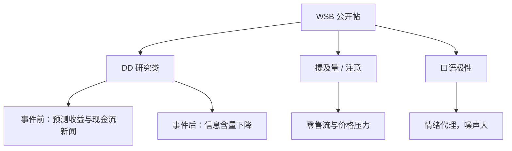

# WSB 舆情因子

在 GameStop 事件之前，Wallstreetbets 上的尽职调查帖能够预测收益与现金流新闻；事件之后，强调价格压力与吸引注意的帖子占比上升，可预测性消失。

<footer>—— Bradley, Hanousek, Jame and Xiao, Place Your Bets? The Value of Investment Research on Reddit’s Wallstreetbets, Review of Financial Studies, 2024</footer>

社交媒体把散户讨论从消息板搬到可投票、可刷屏的广场。r/wallstreetbets（WSB）在 2021 年 1 月因 GameStop 成为公共基础设施，也把「舆情因子」从 Tetlock 式专栏推进到论坛文本与提及网络。Bradley、Hanousek、Jame 与 Xiao（2024）把 WSB 的尽职调查（DD）帖与普通提及分开，发现**事件前有信息、事件后变注意游戏**。公开文献中并不存在 Adams–Bloom–Ghent 合写的 WSB 经典论文；Baker、Bloom 与 Davis（2016）的 EPU 是报纸政策不确定，对象不是 Reddit。本篇以 Bradley 等为轴，辅以论坛情绪与提及量的工程口径，并接到 [Da–Engelberg–Gao 关注度](/quant/investor-attention-deg) 与 [舆情文本](/quant/news-nlp-alpha)。不讨论如何操纵版面或绕过平台规则。

## 问题

论坛文本同时装了三样东西：关于现金流的私人整理（DD）、关于涨跌的情绪极性、以及纯粹的显著（ticker 被喊到）。Antweiler 与 Frank（2004）在消息板上已经区分看涨言论与意见分歧。把三样东西压成一个「WSB 分数」再对收益回归，系数不可解释：GME 当周的提及爆炸是注意与协调，不是分析师修订。问题是分层测量，并承认**样本在 2021 年 1 月断了**——用户数、梗、版规与媒体覆盖同时换挡，全样本一个斜率会把两段机制平均掉。

第二句话是代表性。WSB 用户不是随机散户：更年轻、更杠杆、更偏期权，持仓集中在高 IVOL、高 MAX、低价名字。因子若在全市场截面上显著，往往是因为左边这组股票被重权，而不是因为论坛对 IBM 有定价权。评价应在可投资宇宙与「WSB 常客宇宙」上分开报。

### 提及、极性与 DD 不是同一个因子

**提及量**接近 Da 等的注意力：谁被喊到。可用去重用户数、帖子数、评论数；机器人与复读机要把同一用户重复喊单算一次。**极性**需要金融口语词表：rocket、puts、tendies、bagholder 不能靠通用情感词典。Loughran–McDonald 在 10-K 上有效，在 WSB 上会把 slang 读成中性或读错。**DD 帖**是 Bradley 等的识别：较长、带持仓与论点、被社区标成研究，而不是 meme。事件前 DD 预测随后收益与分析师/盈余新闻；事件后同类标签的帖更多在写「空头回补」与价格压力，预测力集中消失在这一子类。因此「WSB 情绪因子」若用全论坛词袋，测到的主要是注意与协调，不是 DD 的信息含量。

Karma、热帖算法与版主删除会把可观测文本变成平台筛选后的样本。用事后完整 dump 回测「当时能看到的热帖」，会高估信息到达速度。点-in-time 应保留爬取时刻的排序与已删除标记，而不是以今天的存档代替当时的广场。

## 方法

**公司级日频。** 抽取 ticker（处理 $GME 与 GME、括号、常见英文词误伤），在 $t$ 日收盘前可获得的帖子上汇总：去重提及、极性净额、DD 虚拟变量或 DD 净推荐。特征在收盘锁定，预测 $t+1$ 起的收益，避免用盘后发酵解释当日收益。控制上日收益、换手、新闻条数、[ASVI](/quant/investor-attention-deg)、市值与行业。增量若只存在于未控 ASVI 时，则 WSB 只是搜索注意的一个下游喇叭。

**市场级。** 把全论坛净极性或高热 ticker 的市值加权，做成零售情绪的日度代理，对照 [Baker–Wurgler](/quant/baker-wurgler) 的月度指数与 Tetlock 专栏。频率不同：BW 解释截面投机性股票的相对定价，WSB 日度更像流量冲击。二者不要争「谁是真正的情绪」。

**样本切分。** 预指定 GME 事件窗（例如 2021-01 前后），分别估计。Bradley 等的关键表是：事件前 DD 的预测在，事件后无；事件后价格压力类文本占比上升。复制若只报全样本，等于拒绝回答他们提出的问题。

### 中性化、期权与迷因周

WSB 名字与 [IVOL](/quant/ivol-anomaly)、[MAX](/quant/max-effect)、低价、高换手高度重叠。原始多空会变成彩票组合。应在截面 rank 后对行业、市值、残差波动回归，见 [特征 rank](/quant/cs-rank-features)。期权活跃周要把异常期权成交与股票收益分开：许多「WSB 收益」其实是短期 call 的 Delta 与 Gamma 涌入，现货只是一条腿。迷因周（单一 ticker 占论坛流量过高）应单独成组或剔除后报告，否则一个 GME 决定全年夏普。

## 机制

事件前的机制更接近「众包研究被低估」：一部分较长的 DD 整理了尚未被价格充分吸收的公开信息，散户跟随这些帖子交易，随后出现与现金流新闻同向的收益。事件后的机制更接近 Barber–Odean 注意与协调博弈：用户知道喊单可以吸引后来者，文本鼓励的是挤压与关注，而不是盈余。文化切换一旦发生，同样的爬虫和同样的词袋会从信息因子变成拥挤因子。这与 Da 等的搜索注意同族，但 WSB 多了**内生协调**：搜索是分散的查询，论坛是可见的共同知识。

意见分歧（看多看空同时刷屏）会抬成交与期权量，对收益的符号不稳定，这与 Antweiler–Frank 一致。把分歧当看涨信号，是把「有人在吵」当成「有人知道」。更干净的是把分歧当波动与换手的状态变量，把 DD 方向当（事件前的）信息，把提及残差当注意。

### 与情绪指数、搜索注意的分工

Baker–Wurgler 用市场代理抽月度投机需求，不含 Reddit。EPU（Baker–Bloom–Davis）用报纸政策词，更不是 WSB。Da–Engelberg–Gao 的 SVI 是搜索注意，先于或并行于论坛。WSB 因子若还有增量，应出现在：控制 ASVI 与新闻后，DD 仍预测（事件前），或提及残差仍预测极短窗口的零售不平衡（事件后）。没有这两层对照，不宜宣称「发现了新的社交媒体溢价」。

把 2021 年 1 月的 GME 收益算进因子的样本外夏普，是把一次性协调事件当成可重复的 alpha。产品说明书若以该月为锚，测的是生存者叙事，不是预期收益。

## 边界与工程取舍

Adams–Bloom–Ghent 并非一篇可引用的 WSB 原论文；不要为了凑三人名字把 EPU 与 Reddit 焊在一起。不要用通用 NLP 极性代替 DD 分类。不要假设 API 今天能回放 2018 年的完整热帖排序。中文论坛（雪球、股吧）同构但词表、机器人与监管环境不同，应另文，不能把 RFS 的事件后结论直接写成「散户社交媒体一律无信息」。

容量与合规：即使事件前 DD 有纸面 IC，可交易性受限于那些名字的借券、期权流动性与平台审核延迟。作为风险仪表，WSB 提及拥挤对迷因敞口有用；作为可规模化因子，事件后证据弱。监管讨论的是披露与市场质量，不是把版面情绪写进月度再平衡。

出处：Bradley, Hanousek, Jame and Xiao, *Review of Financial Studies*, 2024。消息板见 Antweiler and Frank, 2004。EPU 见 Baker, Bloom and Davis, 2016，对象不是 WSB。注意力见 Da, Engelberg and Gao, 2011。

## 小结

- WSB 文本应拆成 DD、极性与提及；混成单一「情绪分」无法对照机制。
- Bradley 等表明：GME 之前 DD 有收益与现金流预测力，之后转向注意与价格压力，预测力消失。
- 公开文献中不存在作为 WSB 经典来源的 Adams–Bloom–Ghent 论文；EPU 是报纸政策不确定。
- 因子必须对 ASVI、MAX/IVOL、迷因周与期权流做对照，并预指定事件切分。
- 点-in-time 要保留当时可见的排序与删除，不能用事后 dump 代替广场。
- 出处：Bradley, Hanousek, Jame and Xiao, *RFS*, 2024；Antweiler and Frank, 2004；Da, Engelberg and Gao, 2011。
