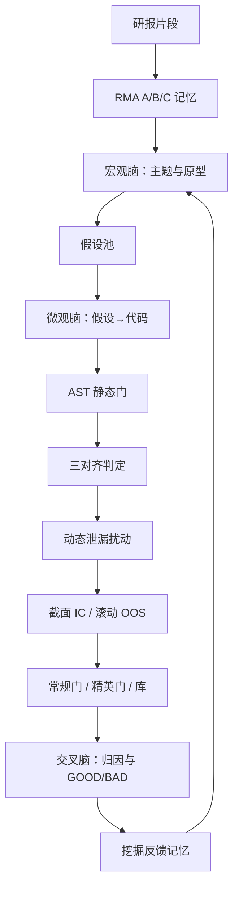

# XAlpha：假设到代码

    
把 alpha 挖掘从一次性生成因子，变成持续的「阅读—假设—实现—验证—反思—演化」；金融假设必须落成可执行代码，并在想法、逻辑与金融合理性之间事先对齐。

    <footer>—— Liu, Fu, Wang and Liu, XAlpha: A Memory-Driven AI Quant Researcher for Hypothesis-to-Code Alpha Discovery, arXiv:2607.08332</footer>

Alpha-GPT 从自然语言想法出发，Hubble 从 DSL 公式出发。XAlpha（Liu 等人，香港大学 / Grace Investment Machine，arXiv:2607.08332）把对象换成完整的研究环：外部研报吸入记忆，宏观脑选主题与原型，微观脑把假设写成 OHLCV 因子代码，交叉脑把结果写回记忆。名字里的 X 表示市场里未知的可预测结构。它针对的工程缺口是：现有 LLM 挖掘多半自动化孤立步骤——生成、搜索、打分——而不是一个能吸收外部知识、闭合「假设到代码」、并从成败里学习的研究者。公开实验在 CSI300 上对比若干基线。读结果时仍套 McLean–Pontiff 与 Hou–Xue–Zhang：中证 300 比微盘宇宙干净，但不免除发表后衰减、成本与多重试验；系统若吸入已发表研报，记忆本身就是拥挤先验。

## 问题

人的工作流是：读材料、形成可检验假设、写成因子、看是否像那么回事、回测、把成败记下来再开下一轮。机器学习预测器不透明；遗传规划按适应度搜，不按金融推理搜；许多 LLM 系统仍停在公式或单次生成。XAlpha 要填的是记忆与计划：没有记忆会重复失败模式；没有宏观计划会在同一家族里空转；没有代码层验证，假设与实现会悄悄分叉。

约束很硬。日频 OHLCV 合同决定哪些研报片段可保留：依赖订单簿或基本面、又无法用开高低收量稳定代理的机制，在吸入层就被丢掉。这不是万能研究员，是「在 OHLCV 因子合同下的研究员」。公开信息对经纪商级数据、完整研报语料与超参并不充分，复现应对齐论文写明的门与评分，而不是假设存在未公开的另类数据管道。

### 假设—代码—金融的三重对齐

微观脑在回测前做事先（ex-ante）三对齐：假设陈述、代码逻辑、金融合理性是否一致。这与 Hubble 的 AST 三重门不同。Hubble 挡的是非法树；XAlpha 还挡「合法但没实现它所声称的假设」——例如假设写反转、代码写成动量，或声称用波动确认却从未引用高低价。三对齐由判定代理执行，有误判率，不能替代数值门。它的产品意义是审计：库里每一行因子都能指回一条假设，而不是一堆无故事的夏普。

三对齐不能证明机制为真。它只证明叙事自洽。自洽的错误定价故事仍然可以是样本内巧合。经济显著性与样本外窗口仍是后面的门。

## 方法

**研报到记忆（RMA）。** 片段按 A/B/C 三层写入。A 层：OHLCV 可行性，KEEP/DROP。B 层：机制家族（趋势动量、反转、价量交互等）与可复用研究路径。C 层：可检索的研究原型（Archetype），含机制角色与路径；原型不是公式本身。这样研报不会被硬编码进公式，只变成计划阶段的线索。

**宏观脑。** 周期级计划。路由模式：固定主题、粗引导、或由记忆驱动。默认先若干粗引导周期覆盖重要家族，再切到记忆驱动，用 GOOD/BAD 摘要与原型覆盖去避开已饱和或反复失败的方向。每个周期选 1 条主 B 层加 3–4 条支撑 B 层，检索 C 层路径，组成带角色的假设池，交给微观脑。

**微观脑。** 把假设池写成可执行 Python 因子，之后以代码演化为主：机制级突变、交叉、精炼，而不是随机改语法。质量管道：AST 门做静态检查（语法、禁止导入与字段、负移位一类静态泄漏、复杂度）；三对齐判定；物化序列后的数值门（无效值与极端值比例、低信息日期）；截断与未来噪声扰动的单元测试，捕捉静态看不出的动态泄漏。可修复的失败改完再走同一管道。周期中按配置做新颖性注入，并对当前池做高相关过滤。

**选择。** 常规门维护父池，精英门更严并看训练+验证与滚动样本外，库准入在周期末重算泄漏与指标，相关剪枝后保留有限只。分数由 RankIC/IC 等方向对齐后的稳健指标组成；复杂度在常规门打折。具体阈值以论文附录为准，工程上应把它们当预指定超参冻结。

**交叉脑。** 因子到原型的归因（演化后机制可能已变）、GOOD/BAD 反馈、多层记忆更新，供后续新颖性注入与宏观路由。闭环是：读、假设、实现、验证、反思、演化。

### 记忆把尝试次数从无状态变成有状态

无记忆的生成器每次从先验重抽，失败过的模板会回来。有记忆的系统把失败写成负线索，把成功写成可再组合的机制。这对 PBO 是双刃：有效 $N$ 可能下降，因为不再盲试；但记忆若被样本内成功污染，会把过拟合路径当成「已验证规则」永久化。隔离要求：写入记忆的胜负必须来自声明的训练段；验证段与实盘段只读。McLean–Pontiff 的已发表预测变量，应作为负向或「已知拥挤」线索进记忆，而不是当正例去模仿。

CSI300 上的「强于基线」是挖掘效率陈述。基线若不含同样的研报记忆，比较的是工作流，不是同一个假设空间。报告应拆开：无 RMA、无交叉脑、无三对齐的消融，才能看出每一块贡献的是 IC 还是只是少报错。

## 机制

宏观脑降低主题熵：每一周期只在少数家族里假设，避免全空间随机公式。微观脑把假设当作可演化的代码个体，适应度来自截面预测与稳健，而不是来自模型自评。交叉脑把适应度翻译回家族语言，使下一轮计划能理解「反转家族在滚动样本外死了」。RMA 的 A 层是类型系统：不进入合同的知识不允许变成因子，从源头减少幻觉字段。

静态 AST 门与动态扰动分工。负移位、非法导入是语法层泄漏；「用当日已知的未来填充」或对齐错误是数据层泄漏。扰动测试在因子值上加未来噪声或做截断，看分数是否异常依赖未来。这与[防止未来函数](/quant/no-future-function)同一精神，只是代理化了。Hubble 把静态三层做硬、公式更纯；XAlpha 允许 Python 因子代码，所以静态+动态都要。

### 假设到代码不是因果识别

把研报写成假设再写成代码，容易看起来「有经济学」。资产定价里许多研报片段是事后叙事。RMA 保留的是可 OHLCV 代理的机制，不是因果。Hou–Xue–Zhang 复制失败的摩擦故事，可能仍会通过 A 层（换手、振幅都在 OHLCV 里），因此 B/C 层与评分必须显式惩罚高换手摩擦模板，否则记忆会高效再产不可交易异常。经济轴不能外包给研报措辞。

## 边界与工程取舍

公开信息有限：完整研报语料、CSI300 的精确区间与成本模型、判定代理的提示，arXiv 无法一键复现。OHLCV 合同切掉基本面与微观结构 alpha，范围要在摘要里写清。三对齐判定是 LLM，会把文风流畅当成合理。AST 门的导入白名单若日后放开「为了方便」，沙箱即失效。库准入的相关阈值（文中约 0.6）过松则拥挤，过紧则只剩一个家族。

不要把多脑图理解成可以无人值守地进入实盘。论文出口是因子库与研究状态，不是订单。实盘仍要冻结哈希、成本 MC、漂移监测。记忆更新必须停在研究账户；用实盘盈亏写 GOOD/BAD 会把实盘当训练。

出处：Liu et al., *XAlpha*, arXiv:2607.08332。对照 Wang et al., *Alpha-GPT*；Shi et al., *Hubble*。评价：McLean–Pontiff, *JF*, 2016；Hou–Xue–Zhang, *RFS*, 2020。自主科研代理的一般范式见 Lu et al. 的 AI Scientist 一类工作，XAlpha 将其收窄到金融假设-代码环。

## 小结

- XAlpha 把挖掘写成带记忆的假设到代码环：RMA 吸入研报，宏观脑计划，微观脑实现与演化，交叉脑回写。
- 事先三对齐检查叙事与代码一致；AST 静态门加动态扰动检查泄漏。合同是日频 OHLCV，不是全市场数据。
- 记忆降低重复失败，也可能把样本内路径永久化；写入必须限制在训练段。
- CSI300 优于基线说明工作流，不自动说明可交易溢价；摩擦类机制仍要按 Hou–Xue–Zhang 打折。
- 出口是因子库，不是交易。
- 出处：Liu et al., arXiv:2607.08332；对照 Alpha-GPT 与 Hubble；评价见 McLean–Pontiff 与 Hou–Xue–Zhang。
