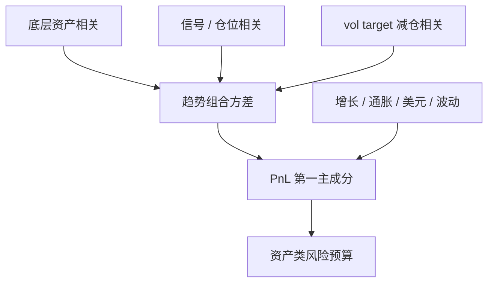

# 跨资产趋势相关

趋势在股指、债券、商品与外汇上同时存在；组合的价值来自这些趋势实现之间并非永远高度相关——直到全球风险预算把它们暂时焊在一起。

<footer>—— 对照 Moskowitz, Ooi & Pedersen, Time Series Momentum, JFE 2012；Asness, Moskowitz & Pedersen, Value and Momentum Everywhere, JF 2013</footer>

单资产趋势的夏普通常平庸，管理期货的夏普来自分散。Moskowitz 等人的 TSMOM 在数十个期货上取平均；Asness、Moskowitz、Pedersen 证明动量风格在跨资产上有共同成分，也仍有可分散的残差。本篇写 **趋势盈亏的相关结构**：底层资产相关、信号同号相关、减仓相关，是三件不同的事。配置 CTA 的人若只用底层 $\rho$ 去想象分散化，会在 2013、2018、2020 一类全球波动冲击里发现：趋势账本的第一主成分突然变大。这与[相关性崩溃](/quant/correlation-breakdown)同构，对象换成了趋势策略的 PnL。

## 问题

记资产 $i$ 的趋势仓位为 $w_{i,t}$，盈亏为 $w_{i,t}r_{i,t+1}$。组合方差取决于 $w$ 的截面分布与 $r$ 的协方差。即使 $\mathrm{Corr}(r_i,r_j)$ 中等，只要 $w_i$ 与 $w_j$ 长期同号（全球风险偏好同时上升），趋势组合会表现得像一个加了杠杆的风险资产。反之，底层高度相关但趋势信号在两类资产上反号（股跌债涨的经典趋势），组合可以很稳。问题是测量三层相关，并说明它们在危机里如何变。

第二个问题是「趋势的趋势」：若所有市场的十二个月收益同号，CTA 净暴露极大，分散化名存实亡。这不是相关矩阵坏了，是信号进入了共同状态。Hurst–Ooi–Pedersen 的长样本里，这种共同状态有时持续数年（商品与利率的超级周期），有时在政策反转里一夜结束。

### 底层相关、信号相关、减仓相关

**底层。** 股指之间高，商品板块内高，外汇对里对美元的共同成分高。这是被动期货多头的相关。

**信号。** $\mathrm{Corr}(\mathrm{sign}_i,\mathrm{sign}_j)$ 或仓位相关。趋势在「全球增长上修」时股、商品、高息货币可能同号；在「增长下修、宽松」时股空债多，信号负相关，这是 CTA 经典分散。

**减仓。** 即使信号仍然分散，vol targeting 与保证金在波动共同上升时对所有合约乘上近乎同一因子 $1/\hat\sigma_{\mathrm{world}}$。减仓相关可以在信号相关仍然温和时接近 1。拥挤螺旋关心的是第三层；宣传册上的「低相关」常常只报第一层的全样本。

$$
\mathrm{Var}\Bigl(\sum_i w_i r_i\Bigr)
=\sum_i\sum_j \sigma_i\sigma_j\rho^r_{ij}w_iw_j,
$$

$w$ 本身是信号与 $1/\sigma$ 的函数，危机里 $w$ 与 $\rho^r$ 一起变。

「CTA 与股票相关接近零」是全样本、含多空切换的数字。条件于「过去一年全球风险资产同向」，这个相关会升到难堪的水平。尽调应给状态条件相关，而不是一个点。

## 方法

报告三张矩阵：资产超额相关、趋势仓位相关、趋势 PnL 相关，分平静样本与高波动样本。再报告第一主成分解释的 PnL 方差份额，以及净市场暴露（股指腿合计、久期合计）。Baltas–Kosowski 一类研究强调波动缩放与回看窗口会改变这些数字：更快的信号让仓位相关更吵，更慢的信号让共同状态持续更久。

合成组合时，资产类预算优于纯粹的合约等风险：否则十个农产品合约在统计上「很分散」，经济上仍是同一天气与同一套保流。跨类等风险（股指、债券、商品、外汇各四分之一风险）是管理期货的默认骨架，类内再等风险。检验分散化是否工作，看的是类间趋势 PnL 相关，不是类内合约个数。

### 共同因子：增长、通胀、美元、波动

趋势组合的主成分往往能讲成宏观故事：全球增长（股与工业品同向）、通胀（利率与商品）、美元（外汇与以美元计价的商品）、以及波动（所有 vol target 一起缩）。这些不是要你改去做宏观预测，而是要你知道：当四个故事叠成同一个方向时，CTA 不再分散。与 AMP 的全球动量因子一致——风格有共同风险。对冲共同因子会牺牲一部分危机 alpha（空头股指正是增长因子的负端），所以对冲与否是产品定义，不是统计错误。

## 机制

趋势溢价可以在每个市场上局部存在（反应不足、套保），同时被全球资金流焊出共同成分。AMP 用资金流动性等变量解释价值与动量的共同运动；CTA 上，风险平价与波动目标基金的增长本身就是共同成分的来源：大家都用相似的 $L$ 与 $1/\sigma$。分散化在「局部噪声趋势」上有效，在「全球风险预算」上失效。

危机分两种相关路径。缓慢下跌：股指趋势翻空，债券趋势翻多，商品视通胀而定，信号相关下降，危机 alpha 出现。突然的波动冲击：来不及翻信号，减仓相关上升，所有名义一起缩小，已有趋势仓的盈亏被杠杆下降截断，并可能在反转里集中实现亏损。Kaminski 的危机 alpha 依赖前一种路径；后一种是相关结构发出的警告。

### 不要用合约个数代替有效广度

五十个合约若信号相关 0.8，有效广度接近少数几个因子。用 $N$ 去除以组合波动来暗示信息量，会高估。应报告有效 $N_{\mathrm{eff}}=1/\sum \omega_k^2$，其中 $\omega$ 是主成分风险权重，或用仓位相关矩阵的特征值。容量也按有效广度降，而不是按合约名单长度升。

2010 年代部分时段里，股债商品外汇的趋势共同变弱、震荡同步，CTA 夏普下降。这是信号相关上升且单边变短，不是「趋势永远失效」的证明，但也禁止把 1970–2000 的分散化数字当永恒。

## 边界与工程取舍

不要把底层低相关写成产品卖点而不附仓位相关。不要在全球信号已经高度同号时仍按平静期杠杆满仓。不要把 CTA 与股票动量、风险平价叠在同一账户而不检查股指腿与 vol target 的共同减仓。国内品种池更窄、政策同向更强，跨资产分散的有效广度小于全球 CTA 样本。

与[价值与动量无处不在](/quant/value-momentum-everywhere)对照：AMP 的动量主要是截面，TSMOM 是时间序列；两者的跨市场共同因子都可以存在。与风险平价对照：RP 的相关结构是底层多头的相关，CTA 的相关结构被 $w_{i,t}$ 的变号改写，全样本相关更低，条件相关可以更高。

出处：Moskowitz, Ooi & Pedersen, JFE, 2012；Asness, Moskowitz & Pedersen, JF, 2013。长样本与宏观可解释性见 Hurst, Ooi & Pedersen 的趋势综述。危机路径见 Kaminski 的 crisis alpha。相关估计偏差见 Forbes–Rigobon 与 Brunnermeier 对螺旋的叙述。

## 小结

- 管理期货的分散化取决于趋势仓位与减仓的相关，不只取决于底层资产相关。
- 信号共同状态与 vol targeting 会把「低相关产品」焊成单一风险预算因子。
- 应分平静/压力报告仓位相关、PnL 主成分与净暴露；有效广度按特征值算，不按合约个数。
- 缓慢危机里信号负相关提供危机 alpha；突然波动冲击里减仓相关破坏分散化。
- 出处：Moskowitz et al., 2012；Asness et al., 2013；Hurst–Ooi–Pedersen；Kaminski。
