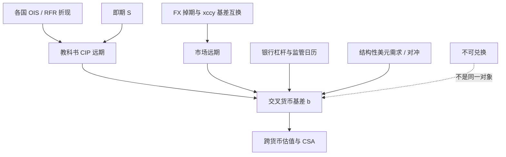

# 交叉货币基差

危机之后，用两国 OIS 与即期去合成的远期，不再等于可交易的 FX 掉期；差额被单独报价，叫做交叉货币基差，它衡量的是换入美元（或换出某种融资货币）的资产负债表价格。

<footer>—— Du, Tepper & Verdelhan, Deviations from Covered Interest Rate Parity, Journal of Finance, 2018；危机期间的破裂见 Baba & Packer, Journal of Banking & Finance, 2009</footer>

抛补利率平价在教科书里是恒等式，在 2008 年之后的 G10 市场上是一条带价差的曲线。交叉货币基差（cross-currency basis）就是这条价差：在一笔浮动对浮动的交叉货币基差互换里，为了交换两种货币的本金与浮动利息，一边要在参考利率上加减若干基点。Baba 与 Packer（2009）记录危机中 CIP 的崩溃与美元融资压力。Du、Tepper 与 Verdelhan（2018）表明，偏离在危机后**持久存在**、有符号、并与银行的资产负债表约束（杠杆率、资金、监管报告时点）一起波动；套利者不能无限制地把基差压回零。本篇把它写成估值里必须输入的曲面，而不是「远期模型没校准好」。它与 [利率平价](/quant/irp) 的 CIP 会计相接，与 [OIS 与多曲线](/quant/multi-curve-ois) 的折现选择相接，与 [NDF](/quant/ndf) 的管制溢价相区别。

## 问题

取欧元对美元。无基差的 CIP 说，FX 远期应由即期与两边无风险折现决定。市场 FX 掉期给出另一条远期。定义基差 $b$ 使得

$$
F^{\mathrm{mkt}}=S\cdot\frac{P^{\$}(0,T)}{P^{€}(0,T)}\mathrm{e}^{bT}
$$

（符号惯例随标价与「谁在被加基点」而变，文档必须钉死）。$b<0$ 的常见叙事是：非美机构需要美元，愿意在换入美元时接受不利的基点，即「美元贵」。问题是选择折现：$P$ 用 OIS、LIBOR 还是国债，会改变 $b$ 的水平。危机后正确的对照是抵押曲线（OIS / SOFR / €STR），因为批发融资与衍生品 CSA 靠近隔夜指数；再用 LIBOR 去算 CIP，会把银行信用混进交叉货币。Hull 式的单曲线恒等式在这里不够，见 [即期、远期与折现](/quant/spot-forward-df)。

第二层是工具：短端基差主要在 FX 掉期里，长端在交叉货币基差互换（本金期初期末交换、浮动对浮动）里。两条曲面要拼接。忽略拼接，五年 CIP 与五年基差互换会对不上，造成虚假的期限结构交易。

### 符号、报价与「谁贵」

市场习惯常把欧元—美元基差报成负值：付欧元浮动、收美元浮动时，美元腿要减去若干基点。不同货币对、不同时代（LIBOR 与 RFR）的惯例不统一。内部系统应把基差存成「相对 CIP 的连续复利修正」，再映射到经纪商惯例，而不是在研究笔记里用口语「美元贵」而不写腿。日元、瑞郎等融资货币也有持久基差，符号与美元短缺、日元资产的对外对冲需求有关，不能用同一个故事套所有货币对。

季末、年末的基差跳升是监管与报表约束的证据，不是外汇宏观新闻。Du 等人把这类日历效应与 CIP 偏离的截面放在一起，支持中介约束而非「投资者突然违反无套利」。

## 方法

构建步骤：先对每种货币自助 OIS（或当前 RFR）折现；取即期与 FX 掉期点，得到市场远期；解出 $b(T)$。长端用基差互换报价直接当节点，注意本金交换与标记货币。多货币时选美元为枢纽：EUR/JPY 的交叉基差应由 EUR/USD 与 USD/JPY 合成，再与稀薄的直接交叉报价比残差——这是 [交叉汇率三角](/quant/fx-triangle) 在掉期上的版本。

估值：凡涉及两种货币本金交换或跨货币 CSA 的衍生品，折现不能只用本币 OIS。常见做法是对本币现金流用本币 OIS，对外币现金流用「外币 OIS 加交叉货币基差」调整后的曲线，使 FX 远期与市场一致。忽略 $b$，等于假设你可以按 CIP 无限转换抵押货币；这在 2010 年代会给欧元、日元账簿留下结构性错价。

交易：基差可以作为相对价值（相对监管日历、相对发行窗口的公司债对冲需求），也可以作为对冲（预测美元短缺时买入美元基差保护）。它不是 UIP 套息：套息暴露汇率；抛补后的基差交易暴露的是中介约束。Fama（1984）管前者，Du 等人管后者。

### 与多曲线、CSA 的接口

同一法律实体，美元 CSA 与欧元 CSA 的组合，折现已经不同；再允许抵押货币转换，就会出现最便宜抵押（CTD collateral）与交叉货币基差的联合。工程上这是多曲线的下一层，不是本篇能写完的系统，但原则相同：可交易的转换有价格，价格就是基差。IBOR 退出后，基差互换改挂 SOFR/€STR/TONA，历史 LIBOR 基差序列不能未经调整地接在 RFR 序列后面当同一因子。

## 机制

复制 CIP 需要占用银行的资产负债表：借一种货币、贷另一种、做外汇掉期，并满足杠杆率、G-SIB、流动性覆盖。当全球需要美元（欧洲银行、日本寿险对冲、储备经理），而提供美元的中介资本昂贵，均衡基差就不会是零。Baba 与 Packer 观察到的是急性美元短缺；Du、Tepper 与 Verdelhan 观察到的是慢性的、监管强化后的短缺定价。这与凯恩斯商品套保压力同构到「谁必须对冲、谁能提供风险资本」，但市场是货币而不是铜。

供给需求的可识别冲击包括：外国发行人的美元债对冲（创造对美元的掉期需求）、日本机构的外币资产对冲、季末窗口。基差在这些时点变宽，并不是即期汇率的 PPP 故事，也不是 NDF 的兑换权故事。把三者混成「外汇基差因子」，截面上会把 KRW NDF 与 EUR 交叉货币放在一起，机制检查无法通过。

CIP 偏离持久，不表示存在无人认领的印钞机。认领需要廉价的银行资本与额度。把回测写成「每日吃基差、无融资约束」，与文献的结论正好相反。

### 危机流动性与常设机制

美联储的美元互换额度可以在急性期压住短端基差，因为境外央行能提供美元。额度的存在改变尾部，不一定把常态基差压回零——常态仍由监管与结构性对冲需求决定。模型若只在 2008 年样本里估一个危机哑变量，会把 2010 年代的慢性基差当成异常值丢掉。应允许一个慢变的基差水平，外加压力中的跳。

## 边界与工程取舍

新兴市场可兑换货币（如部分拉美）的「CIP 偏离」可能同时含信用、可兑换性担忧与真正的交叉货币基差。应先问：本金能否自由交换？若不能，先读 NDF。G10 内部，基差也不是纯银行因子：主权信用、清算会员资格、制裁名单会突然切断复制。负利率时期的日元、欧元，日计数与复利惯例使 $b$ 的换算容易错符号。

不要用国债利差替代 OIS 去解释基差水平，除非你显式交易的是政府信用对银行抵押曲线。也不要把交叉货币基差当成 PPP 锚的高频版本：物价篮子不在这个市场里交易。

报价惯例在 RFR 迁移中改过腿的加减方向。历史序列拼接必须经过一份惯例表，否则 2018 年与 2024 年的「同一货币对基差」差一个符号，策略会反着做。

## 小结

- 交叉货币基差是市场远期相对 OIS-CIP 远期的修正，必须作为输入曲面，不能当残差清掉。
- Baba–Packer（2009）描述急性破裂；Du–Tepper–Verdelhan（2018）描述危机后持久偏离与中介约束。
- 折现应用抵押曲线；用 LIBOR 或国债会把别的信用写进 $b$。
- 短端掉期与长端基差互换要拼接；交叉货币由美元枢纽合成后再比直接报价。
- 它不是 UIP 套息，不是 PPP，也不是 NDF 可兑换性溢价。
- 出处：Du, Tepper and Verdelhan, *Journal of Finance*, 2018；Baba and Packer, *Journal of Banking & Finance*, 2009；CIP 原式见 Keynes, 1923；高频可执行性对照 Akram, Rime and Sarno, 2008；多曲线背景见 Bianchetti, *Risk*, 2010。
