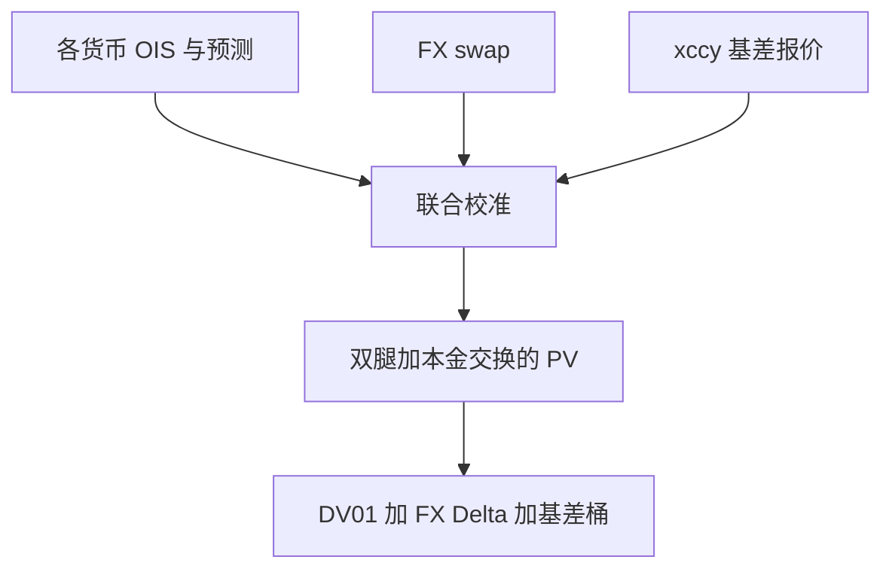

# 交叉货币互换定价

交叉货币基差把「用外国曲线贴现外国腿」这条教科书等式打破；本金交换与基差报价是同一件事的两面。

<footer>—— 多曲线与 xccy 基差见 Fujii, Shimada and Takahashi 以及市场上 USD/JPY、EUR/USD 基差报价惯例</footer>

[上一课](/quant/fx-barrier-touch)还在 FX 期权路径。交叉货币互换（xccy swap）的缺口是**线性产品里的基差**：交换本金、交换浮息，报价却是一腿上的基差利差，而不是 GK 的 $\sigma$。主干 [交叉货币基差](/quant/xccy-basis) 已写经济含义。本课写定价引擎如何把基差曲线与两条单货币曲线、FX 远期一起用，接到后课商品之前把 FX 线性产品收口。

## 问题

教科书：把外币腿用外币 OIS 贴现，本币腿用本币 OIS，用 FX 远期把未来现金流换成同一货币，价值应为零。危机后同一信用等级的美元与欧元折现仍差一截，市场用 USD/EUR 基差互换把差报价出来。问题是引擎：三条曲线（USD 贴现、EUR 贴现、EUR 预测或反过来）加 FX 远期，必须联合校准到存款、单货币互换、FX swap 与 xccy 基差，否则期权里用的 $F$ 与互换里用的 $F$ 不一致。

本金交换在期初与期末。基差主要补偿的是「借一种货币、贷另一种」的资金差，不是预期即期的方向。把 xccy 当 FX 方向性产品，会与 Delta 对冲的远期簿重复计算。

### 多曲线是约束，不是装饰

[OIS 多曲线](/quant/multi-curve-ois) 在单货币里已经把预测与贴现分开。xccy 再把贴现拆成按货币、按抵押货币。CSA 若以 USD 现金为抵押，欧元腿的贴现也不再是欧元 OIS。定价必须以净额集的抵押货币为准，这与 [XVA 桥](/quant/xva-bridge) 同一逻辑。

基差可为负（日元长期如此）。模型允许负基差，并不等于允许负的单货币利率——后课移位是另一件事。

## 方法

校准顺序：先各货币 OIS 与 IBOR/RFR 预测，再 FX swap 短端，再 xccy 基差长端，检查再定价误差。估值：投影每条腿的浮息，用对应贴现曲线贴现，期初期末本金用 FX 与贴现换成报告货币。对冲：各货币 DV01 + FX Delta + 基差桶。不要用单一「外汇 Rho」代替基差桶。

MTM 与 reset：部分 xccy 有定期本金重设，降低 CVA 暴露，改变基差敏感度。条款要当状态机，不能当普通固定-浮动。

## 机制

无基差时，FX 远期与利率平价一致，互换公平价差为零。有基差时，市场在说：用欧元抵押的欧元现金与用美元抵押的美元现金，不能通过 FX 无摩擦转换。定价核把这句写成贴现曲线的差。期权的 quanto 调整用的相关，与这条资金基差不是同一个 $\rho$；不要把 xccy 基差当股权-FX 相关的代理。

## 边界

LIBOR 停用后的 RFR xccy、历史基差与新惯例不可混。流动性差的货币对只有短端 FX swap，长端基差外推是模型风险。XVA：xccy 暴露对 FX 高度敏感，CVA 与 IM 必须用同一 FX 动态。

## 小结

- xccy 定价是多曲线加 FX 远期加基差曲线的联合校准，不是 GK 的附属品。
- 本金交换与抵押货币决定贴现；对冲要单独的基差桶。
- 基差是资金与抵押，不是方向性 FX 观点。
- 出处：Fujii, Shimada and Takahashi 关于多货币曲线的工作；市场基差报价惯例。
