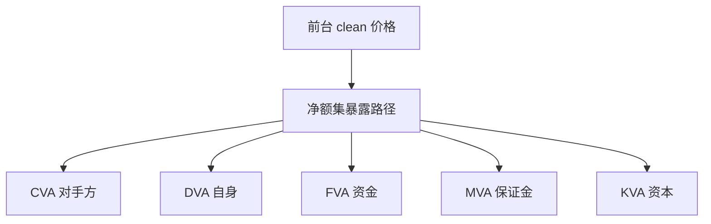

# 到 XVA 的桥

无违约、无抵押、无资金摩擦的风险中性价格，只是 XVA 展开的第一项；后面每一项都是对同一暴露路径抽一次不同的费用。

<footer>—— Gregory, The xVA Challenge；对照 Burgard–Kjaer 对资金与对冲的复制论述</footer>

[上一课](/quant/quoting-conventions)把报价惯例写成坐标变换：内部用统一 $(T,K)$，对冲再用 Jacobian 换回市场语言。缺口是柜台价还不是入账价。主干 [CVA 要点](/quant/cva-lite) 已写对手方违约的那一项；本课当桥，把 CVA、DVA、FVA、MVA、KVA 放进同一暴露引擎。不重讲 ATM 定义。后课 FX 与商品仍用无 XVA 的定价核起步；结构票据与净额集要回到这座桥。

## 问题

前台模型给出 $V^{\mathrm{clean}}$。入账要减 CVA、加 DVA、加减资金（FVA）、减初始保证金的资金（MVA）、以及资本费用（KVA，若内部经济资本要进价）。问题是这些调整**共用**模拟的暴露 $V_t$，但乘的曲线不同：CDS 生存、自身 CDS、资金利差、IM 规则、资本权重。把 XVA 当「在 clean 价格上加几个基点」，等于假定暴露是常数贷款，Gregory 已否定。

净额与 CSA 改变 $V_t^+$ 的形状：有抵押时 CVA 小、MVA 大。同一张 autocallable，在不同净额集里的 XVA 可以差一个数量级。拆解课的「债 + 期权」在 XVA 层变成「净额集 + 保证金协议 + 资本」。

### 不要把 DVA 当利润留存

[DVA](/quant/dva-own-credit) 是自身信用变差时的账面收益。对冲它要用自己的信用，实务几乎做不到，很多机构把 DVA 从交易员 PnL 剔除。桥的任务是让会计、限额、交易员三套数字能对上哪一项在哪张表，而不是争论 DVA 是否「真实」。

FVA 是否进入无套利价格，文献有争议（Hull–White vs 实务资金台）。实现上资金曲线是真实约束；模型上应把假设写进确认，避免与 CVA 双重计算同一信用。

## 方法

一条暴露引擎：市场因子路径 → 按前台模型重估每笔 → 按净额集与 CSA 聚合 → 输出 EE、PFE、IM 路径。CVA 用 EE 与对手方违约密度，见 CVA 课。MVA 用 [初始保证金](/quant/mva-initial-margin) 路径的资金成本。KVA 用资本路径的成本。AAD 穿过暴露引擎才能给 XVA 的市场桶，否则只有 clean Vega。

新产品接入：先问进哪个净额集、何种 CSA、是否强制 IM，再问用哪套前台模型。没有这三问，奇异校准再精细也只是 clean 世界。

## 机制

Clean 价格假设可以无摩擦复制。XVA 把摩擦写回：对手方可能消失、你可能消失、你借钱有利差、监管要 IM 与资本。每一项都是对同一 $V_t$ 路径的不同泛函。因此模型风险与校准误差会**杠杆式**进入 XVA：障碍在壁附近的暴露尖峰，CVA 与 IM 都放大。Cont 的模型带在 XVA 上通常比在 clean 价格上更宽。

## 边界

双重计算：CVA 已含信用，FVA 的信用部分要扣。代理对冲（指数 CDS）留下基差，那是另一条 XVA。流动性枯竭时 CSA 争议与估值代理失效，EE 模型低估。本课不给「最优 XVA 对冲」清单；对象是架构上的桥。

## 小结

- Clean 价格是 XVA 的第一项；其余项共用暴露路径、分乘不同曲线。
- 净额与 CSA 决定形状；新产品先问净额集再问模型。
- 模型带在 XVA 上更宽；AAD 必须穿过暴露引擎。
- 出处：Gregory, *The xVA Challenge*；Burgard and Kjaer 关于资金复制的论文。
