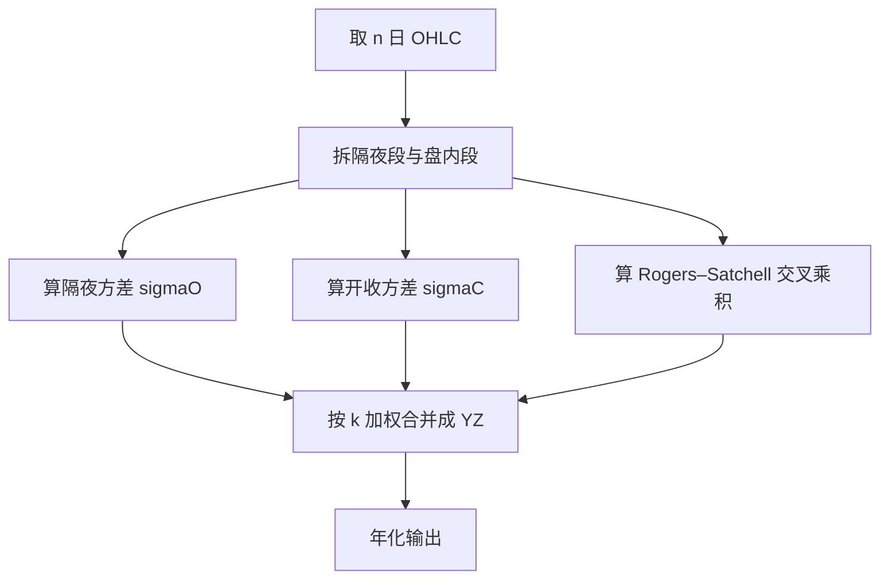
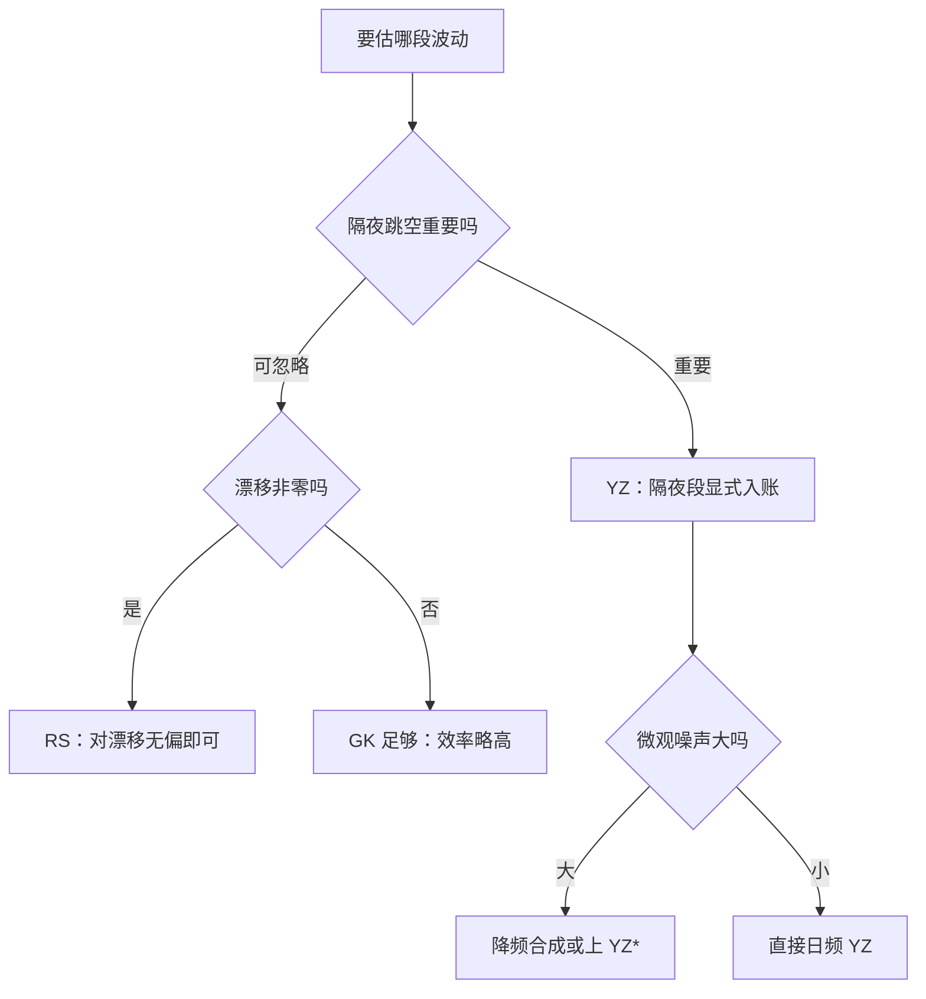

# Yang–Zhang 估计量

把日方差显式拆成隔夜与盘内两段，盘内用对漂移无偏的交叉乘积，再按最小方差加权合并——跳空与漂移两根刺一起拔。

<footer>—— 据 Yang and Zhang, Journal of Business, 2000</footer>

[上一课](/quant/garman-klass)的效率以「无漂移、开盘无跳空」为前提，真实股票两条全破。Yang–Zhang 把日方差显式拆段：隔夜段用收盘到开盘，盘内段用对漂移无偏的 Rogers–Satchell 交叉乘积，再按最小方差权重合并。微观噪声是它剩下的软肋，怎么压决定了它该在什么频率上跑。

## 问题

三个缺口逐个点名。其一，漂移：close-to-close 与 GK 的估计量在漂移非零时都有偏，持仓周期越长偏差越显眼。其二，隔夜跳空：只用盘内 OHLC 的公式（RS 一族）对 gap 完全失明，隔夜方差整段丢失。其三，微观噪声：任何用收盘价差平方的项都随 bid-ounce 膨胀。Yang–Zhang 的目标是同时对漂移与跳空无偏，再把噪声从最窄的门放进来。本课写拆段、加权与失效方向，不展开 YZ* 变体的推导。

术语翻译：拆段即把「昨日收盘到今日收盘」切成「昨日收盘到今日开盘」（隔夜段 $o_i$）与「今日开盘到今日收盘」（盘内段 $c_i$）两张账。Rogers–Satchell 是只用盘内四价的交叉乘积估计量，构造上对非零漂移无偏——代价是看不见隔夜。

## 方法

记 $o_i=\ln(O_i/C_{i-1})$、$u_i=\ln(H_i/O_i)$、$d_i=\ln(L_i/O_i)$、$c_i=\ln(C_i/O_i)$。三个分量：

$$\sigma_O^2=\frac{1}{n-1}\sum o_i^2,\quad \sigma_C^2=\frac{1}{n-1}\sum c_i^2,\quad \sigma_{RS}^2=\frac{1}{n}\sum\left[u_i(u_i-c_i)+d_i(d_i-c_i)\right]$$

合并按 $\sigma_{YZ}^2=\sigma_O^2+k\,\sigma_C^2+(1-k)\,\sigma_{RS}^2$，权重 $k=\dfrac{0.34}{1.34+(n+1)/(n-1)}$。数字实例：$n=10$ 时 $(n+1)/(n-1)\approx1.222$，$k\approx0.133$；$n=60$ 时 $k\approx0.143$——窗口再长 $k$ 也爬不过 0.15，最怕噪声的 $\sigma_C^2$ 永远只拿小头。近理想条件下 YZ 对 close-to-close 的效率约 8 倍，倍数随噪声浮动，别当常数。

## 机制

无偏性来自构造：交叉乘积 $u(u-c)$ 里漂移项在展开后相消，所以 $\sigma_{RS}^2$ 不怕非零漂移；隔夜段显式入账，gap 方差不再失踪；合并权重由最小方差解给出。噪声下的行为更微妙：$k$ 压小让 bid-ounce 只从 $\sigma_C^2$ 一条窄门进来——结果是方差上升而偏差近似不动，这正是小权重的用意。直觉类比：YZ 给一天波动装两块电表——过夜待机表和日内用电表；日内表最容易被接线噪声干扰，于是合并时只给它约 13% 的权重，而不是平分。

常见误区：以为 YZ 万能。错在把噪声与跳跃混为一谈——它治隔夜与漂移，bar 内 bid-ounce 只是压制不是治愈；财报瞬间的离散跳会把所有 OHLC 估计量一起打穿，YZ 没有豁免权。

## 边界

不治跳跃：离散跳之日，五类估计量集体失真，事后剔除事件日比换公式诚实。停牌与集合竞价 bar 的高低差不可信，照单全收会把噪声当波动。实现细节有坑：$\sigma_O^2$ 用 $n-1$、$\sigma_{RS}^2$ 用 $n$ 是原文献口径，混用会引入微小不一致。日波动作为输入，一侧对照隐含口径归 [波动率曲面](/quant/vol-surface)，一侧进 [风险预算](/quant/risk-budgeting) 的限额。至此本单元收束：粒子滤波与无迹卡尔曼管状态、OU 管动力学、Garman–Klass 与 Yang–Zhang 管测量——「估得准」在量化里的三个切面，拼图到此合拢。

## 小结

- YZ 拆段加权：隔夜段补 gap、RS 段抗漂移、小权重 $\sigma_C^2$ 压噪声。
- $k$ 约 0.13–0.15，由最小方差解给出，不随手调。
- 无偏覆盖漂移与跳空；噪声只推高方差；离散跳没有豁免。
- 测量口径与状态估计、动力学参数互为上下游，五个 slug 拼一张图。
- 出处：Yang and Zhang, *Journal of Business*, 2000；Rogers, Satchell and Yoon, 1994；Molnár, 2012 对照。
