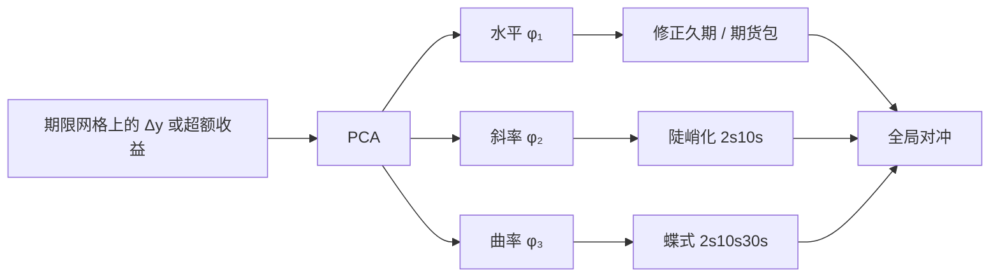

# 收益率曲线因子

    
国债收益的共同变动几乎被三个主成分吸收：平行移动、斜率扭转、以及中段相对两端的弯曲；久期、陡峭化与蝶式并不是三种无关的交易，而是这组特征向量的可交易近似。

    <footer>—— Litterman & Scheinkman, Common Factors Affecting Bond Returns, Journal of Fixed Income, 1991</footer>

把一条名义收益率曲线上的各期限当作一组资产，它们的变动高度共线：很少出现十年涨、二十年不动、三十年反向的独立跳跃。Robert Litterman 与 José Scheinkman 对债券收益（或收益率变动）做主成分，得到后来成为固定收益共同语言的三因子：**水平、斜率、曲率**。本篇写 PCA 在曲线上估什么、如何映射到久期与关键利率，以及统计因子与无套利曲线模型（Vasicek、HJM）之间只是近似相等。更局部的对冲见[关键利率久期](/quant/key-rate-duration)；本篇管全局三因子。

## 问题

$N$ 个期限有 $N$ 个「风险」，若用满秩协方差去对冲，组合要对每一个关键点做对冲，噪声大、交易碎。经验上前三个特征值已经解释大约九成以上的方差：第一次冲击接近所有期限同向移动，第二次是短端相对长端，第三次是中间相对两端。问题是把这个统计事实写成可交易因子，并承认特征向量依赖于样本、期限网格、以及你分解的是收益率差分还是超额收益。

水平因子与平行久期对冲几乎是同一句话，但「几乎」很重要：真实的第一特征向量在短端往往略低、长端略高（或相反，取决于样本），用单一修正久期对冲后仍会留下斜率残差。斜率与曲率则给了陡峭化、蝶式一个方差分解上的理由：它们不是交易员的癖好，而是第二、第三共同冲击的形状。

### 对收益率差分做 PCA，还是对超额收益做 PCA

对 $\Delta y(t,\tau)$ 做 PCA，因子直接说「曲线怎么扭」。对持有期超额收益做 PCA，还混进了滚动、凸性与期限溢价的实现。Litterman–Scheinkman 的对象是债券收益的共同因子，形状仍可用久期标准化后的收益率冲击来解释。实务里两套都做：风险管理更关心 $\Delta y$ 的主成分（下一分钟曲线怎么动），定价与风险溢价更关心超额收益的主成分（哪一个形状被定价）。[Giglio–Xiu](/quant/giglio-xiu) 的逻辑在这里同样适用：形状因子的 λ 取决于它是否落在被定价的空间里，水平冲击方差最大，却不一定溢价最高。

$$
\Delta y_t \approx \phi_1 \ell_t + \phi_2 s_t + \phi_3 c_t.
$$

$\phi_1$ 近似平坦，$\phi_2$ 单调过零，$\phi_3$ 中段一峰两端反号。载荷要用样本估，不能把教科书示意图当成你这套网格上的真特征向量。

水平因子不是水平本身。PCA 做在差分或收益上，水平因子是「平行移动的冲击」，不是十年收益率的水平值。把 $y^{(10)}$ 的水平当因子，测的是久期资产对利率水平的暴露，与 LS 的第一主成分相关但不是同一个估计程序。

## 方法

取一组固定期限的零息或平价收益率，样本协方差（或相关矩阵）做特征分解。用相关矩阵是为了不让波动最高的短端（或最长端）主导；用协方差则保留波动的绝对大小，对冲比率更贴近 PnL。解释方差比例随市场变：平静期三因子更够用，危机里短端政策与长端期限溢价脱钩，第四个因子可能暂时变重要。因子个数不要只看 90% 阈值，还要看对冲后残差是否仍有可交易结构。

可交易近似。水平：久期中性的期限组合，或期货包。斜率：短端对长端的久期中性陡峭化（2s10s、5s30s）。曲率：杠铃对子弹的蝶式（2s10s30s）。这些组合的权重应尽量贴近特征向量，而不是随手 1:-1。关键利率久期把冲击局部化，三因子把冲击全局化：前者防扭曲，后者防过拟合。两者同时用时，要避免把同一平行移动既用久期对冲又用水平因子对冲。

### 与无套利曲线模型的衔接

Vasicek、CIR、Hull–White 一类仿射模型用短端状态变量生成整条曲线，隐含的「因子」是短期利率及其均值回复，形状由模型强制，不是由样本特征向量给出。HJM 直接对整条远期曲线指定波动结构，可以校准出近似水平/斜率的因子，但无套利约束会限制波动的期限结构。PCA 因子一般不满足无套利：任意三个经验特征向量推出来的曲线变动，可能隐含锁定价。工程上 PCA 用于风险与降维，定价用无套利模型；用 PCA 冲击去「模拟未来曲线」时，应对无套利做投影或只在短视野上当作情景，而不是当期限结构模型。

## 机制

水平冲击来自政策利率预期与长期通胀、增长的共同移动：所有折现因子一起变。斜率冲击来自政策路径相对长期中性利率的倾斜——短端跟央行，长端跟增长与期限溢价。曲率冲击更杂：中段供需（养老金、保险的负债匹配）、政策沟通的「中期路径」、以及凸性与波动率变化对中间期限的非线性影响。宏观三分法里，增长与通胀主要进入水平与斜率；流动性与量化宽松会额外扭曲特定期限，表现为曲率或局部关键利率残差。

期限溢价本身可以时变，且往往沿斜率与曲率分布，而不是均匀加在水平上。因此「水平因子方差最大」不等于「水平因子被定价最多」。超额收益对斜率因子的回归，常常比水平更接近期限溢价的故事（长期债券相对短端的补偿）。这与股票里市场因子解释方差、价值因子解释截面均值是同一类错位。

### 信用曲线与通胀曲线不是同一组特征向量

名义国债的 LS 三因子不能直接贴到信用曲线或 TIPS 曲线上。信用利差有自身的水平、斜率，还叠加发行人异质与降级跳跃。通胀曲线的盈亏平衡可以单独做 PCA，第一因子常是通胀水平，第二是短期通胀预期相对长期锚定。把名义三因子当所有曲线的风险模型，会在 2022 年这类通胀冲击里把 TIPS 与名义债的相对价值残差当成「无法解释的 α」。分币种、分曲线族各做一套 PCA，再用宏观因子做第二层，比强行共用一组 φ 更稳。

特征向量会换号、会旋转。子样本里第二因子可能从「短正长负」变成略弯。比较水平因子收益的时间序列前，先把 φ₁ 与某个锚（例如十年变动）的相关定为正，否则夏普符号会无意义地翻转。

## 边界与工程取舍

网格要稳定：今天用 2y/5y/10y/30y，明天加入 7y 和 20y，特征向量会跳。缺失期限用无套利插值补齐，再做 PCA，不要在每日变化的交易品种集合上直接分解。短样本（几年）的第三因子极噪，曲率对冲可能在付点差。期权、按揭、可赎回债对曲线的暴露是状态依赖的，线性三因子只是一阶；波动上升时凸性与负凸性会让残差变大。

不要把 PCA 因子的样本均值当成无风险套利：水平因子带利率方向风险，斜率因子带期限溢价与再定价风险。也不要把三因子写成「债券的 Fama–French」就结束——股票风格是特征排序，曲线因子是期限结构的统计降维，构造与检验语言都不同。A 股利率债与政策短端高度绑定，斜率因子对政策沟通更敏感，美债样本的方差比例不能当本地风控参数。

真实出处：Litterman & Scheinkman, *Common Factors Affecting Bond Returns*, Journal of Fixed Income, 1991。关键利率久期是局部化补充，不是 1991 年论文的原文定义。不要把水平–斜率–曲率标成 Chen–Roll–Ross 宏观 APT 的债券版。

## 小结

- 曲线变动的主成分给出水平、斜率、曲率三个全局因子，解释大部分国债共同收益。
- 可交易近似是久期、陡峭化与蝶式；权重应贴近特征向量，并与关键利率分工。
- PCA 一般不满足无套利，适合风险降维，不替代仿射或 HJM 定价。
- 方差贡献与风险溢价贡献可以错位；信用曲线、通胀曲线要分开分解。
- 出处：Litterman & Scheinkman, Journal of Fixed Income, 1991。
