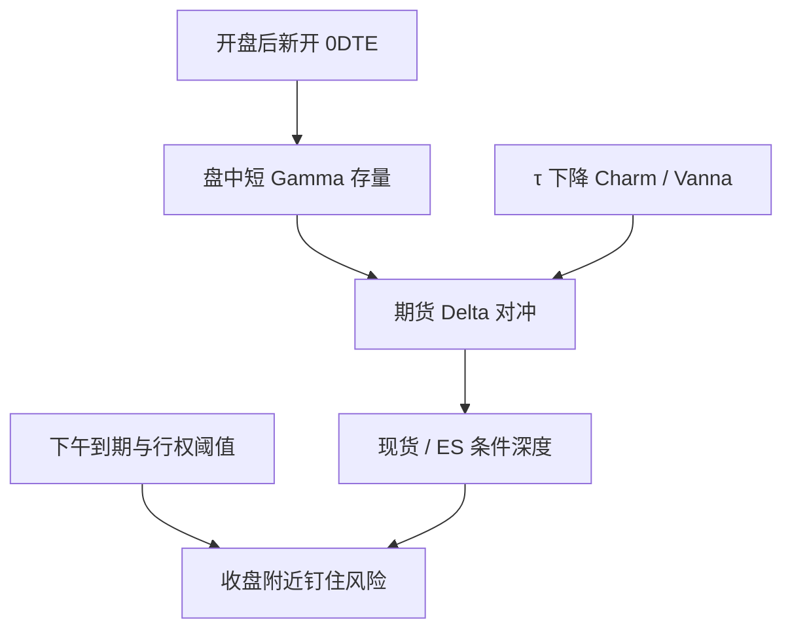

# 0DTE 期权微观结构

到期日为零的指数期权把全天的 Gamma、Charm 与钉住风险压缩到与现货重叠的交易时段；它们首先改变的是对冲与波动的日内剖面，而不是提供可重复的方向配方。

<footer>—— CBOE 将 SPX 到期扩展到每个交易日；微观结构与市场质量的讨论见 0DTE 成交占比上升之后的公开研究（含零售参与、已实现波动与做市存货）</footer>

零日到期（0DTE）期权在到期日当天仍可交易，剩余时间 $\tau$ 以小时计。CBOE 在 2022 年前后把 S&P 500 的到期日历加密到每个交易日，使 0DTE 占 SPX 期权成交的主体。Beckmeyer、Branger 与 Grünthaler 等以及后续关于零售、波动与市场质量的工作，把对象从「月期权存量」改写成「当日到期的流量与极短 Gamma」。微观结构要点是：Gamma 峰贴着现货、[Charm](/quant/higher-greeks) 与 Vanna 在数小时内完成、[pin risk](/quant/pin-risk) 每天发生一次、日终 [GEX](/quant/gex-calculation) 对当日路径滞后。本篇写这些机械事实与公开证据能支持的市场质量命题，**不**写如何跟随或抢跑 0DTE 对冲流。

## 问题

标准月期权的 Gamma 在到期周升高；0DTE 把「到期周」变成「每个交易日的下午」。$\Gamma\sim 1/(S\sigma\sqrt{\tau})$ 在 $\tau\to 0$ 且 $S\approx K$ 时发散，做市的 Delta 限额与对冲带必须按分钟重估，见 [对冲频率](/quant/delta-hedge-freq)。问题从月频存货变成：开盘后新开仓的 0DTE 如何在当日改变有效 Gamma 存量、收盘交割如何把仓位清零、以及现货市场是否因此更吵或更钉。公开数据能较好观测的是成交量、未平仓的日终切片、隐含波动的期限结构短端；不能观测的是每家经销商的盘中账本。因此微观结构研究应落在**可重复的分布事实**（成交的到期占比、短端 IV、到期日现货的已实现核），而不是还原某笔对冲。

零售占比升高使需求更偏方向性、更集中在平值附近的便宜合约。这会改变经销商符号约定的合理性：若顾客净买 0DTE 看涨看跌，经销商在当日更空 Gamma。但这仍是加总假设。Mixon 式的识别问题在 0DTE 上更尖：仓位寿命以小时计，日终 OI 可能已经不是盘中高峰。

### 与周期权、标准月的分工

周权曾经是「短到期」；0DTE 是其极限。定价上，短端更受跳与离散对冲误差主导，Black 公式的 $\Gamma$ 仍被用作对冲语言，但模型误差大。波动交易上，0DTE 更接近对当日已实现的赌注，而不是对一个月方差互换的条带，见 [方差互换与 VIX](/quant/variance-swap-vix)。VIX 本身用两个到期插值到 30 天，0DTE 不直接进入 VIX 公式，却可以影响短端微笑与经销商对 ES 的对冲，从而间接进入现货路径。研究设计不要把「VIX 没包含 0DTE」理解成「0DTE 不影响现货」。

0DTE 的「便宜」是单位权利金低，不是波动便宜。按方差计，短到期的隐含可以很高。用权利金比较月期权与 0DTE 的「价值」会得到错误的拥挤结论。

## 方法

**描述统计。** 每日统计：0DTE 成交占 SPX 期权总成交的份额、平值附近执行价的成交集中度、看涨看跌比、开盘后累积成交曲线。OI 用日终，并承认偏低估盘中。把到期日与非 0DTE 历史到期日分开，避免把「每月一次的 pinning」与「每日 0DTE」混成一个样本。

**市场质量。** 预指定：ES 或 SPX 现货的已实现波动、有效价差、深度、隔夜跳。比较 0DTE 全面上市前后的结构断点须控制宏观，简单前后差异不够。文献关注的是质量是否恶化（更深的尾、更宽的价差）还是仅把成交从周权挪到日权。零售文件（若可得）用于分层，而不是用于识别个人。

**对冲存量代理。** 用当日 0DTE 链的 $\Gamma_{\$}\times OI$ 作为「当日凸性」切片，与剔除 0DTE 的 GEX 并列。盘中用现货重估 $\Gamma(S_t)$，OI 仍用可得的最后快照。这是有噪声的状态变量，用于 [体制](/quant/dealer-gamma-regime) 的日内版检验（例如上下午 RV 是否随短 Gamma 符号变化），不是用于逐笔预测。

### 交割、现金结算与下午剖面

SPX 为现金结算，到期与开盘结算（a.m.）或下午到期（p.m.）规则决定钉住发生在哪一段现货。0DTE 多为下午到期，对冲与行权阈值集中在收盘附近，下午已实现核、尾部与价差应单独报告。开盘结算的月期权把钉住放在开盘拍卖，机制不同，见 [拍卖执行](/quant/auction-execution)。不要用同一种 pinning 检验覆盖 a.m. 与 p.m.。

把 0DTE 成交量直接当「零售情绪」会混进做市对冲成交。成交是双边的。方向性研究需要分类规则，误差在极短到期上更大，因为对冲成交占比高。

## 机制

极短 Gamma：现货一动，经销商 Delta 迅速越限，对冲在期货里留下一串同向或反向的子单，取决于净符号。Charm：即使现货不动，时间流逝也改变 Delta，下午对冲可以在窄幅震荡里发生，见 [Charm](/quant/higher-greeks)。Vanna：短端 IV 随现货跳动，Delta 再调。这三项在月期权上分散在数日，在 0DTE 上叠在同一下午。公开机制叙述到此为止：它们改变**现货吸收客户流的条件深度**，不给出下一笔的符号。

钉住：若大量 0DTE 未平仓集中在某一 $K$ 且现货接近，行权阈值使最后一段时间的对冲不确定，Ni–Pearson–Poteshman 的到期聚类每天都可能出现一小段。证据应报告频率与幅度，避免把偶然收在最大 OI 执行价写成定律。Max pain 民俗与钉住证据的差别见 [Strike Magnetism / Max Pain](/quant/strike-magnetism-max-pain)。

零售与杠杆：权利金低使名义杠杆高，顾客方向错误时亏损上限仍是权利金，经销商一侧是动态对冲。市场质量论文问的是：这种风险转移是否提高现货波动、是否伤害非期权交易者的价差。答案在样本间不完全一致，复制应固定市场与区间，而不是挑选某次「0DTE 导致崩盘」的新闻日。

### 与隔夜、跳空的关系

0DTE 不覆盖隔夜：收盘到期后，隔夜跳空由次日新开的 0DTE 与更长到期共同吸收。隔夜风险仍见 [隔夜跳空](/quant/overnight-gap-hedge)。把「每天都有 0DTE」理解成「隔夜也被期权保险了」是错误的。早盘新开仓使上午的 Gamma 存量从零附近爬升，上午与下午的体制可以不同。

## 边界与工程取舍

不要从 0DTE 成交方向外推指数方向：对冲腿会把符号弄乱。不要用日终 GEX 解释上午的路径。不要把单名 0DTE（若存在）与 SPX 0DTE 共用同一经销商假设。中国指数期权的到期日历与做市制度不同，不能把 CBOE 的成交占比结论直接当作本地微观结构。

公开 0DTE 文献的贡献是描述成交结构、短端波动与市场质量检验，以及提醒 GEX/体制指标必须把当日到期单列。它不是日内剥头皮手册。执行层面的离散对冲与限额，应落在做市风险系统，而不是落在「跟随 GEX」的信号列表。

新闻日与 FOMC 日的 0DTE 是事件合约，跳跃主导，Gamma 对冲公式在跳的瞬间无效。这些日应单独分层，否则会把事件波动记到 0DTE 头上。

## 小结

- 0DTE 把 Gamma、Charm、Vanna 与 pin 压缩到交易时段内，日终存量指标对盘中路径滞后。
- 公开研究应报告成交占比、短端 IV、下午剖面与市场质量，并用时点短 Gamma 做体制检验，而不是还原对冲单。
- 零售与低权利金改变需求形态，但不自动给出现货方向。
- a.m. / p.m. 交割与隔夜缺口必须分开；0DTE 不保险隔夜。
- 出处：CBOE 0DTE 上市与成交统计；Beckmeyer, Branger and Grünthaler 等 0DTE 与零售研究；市场质量与波动的后续公开论文；钉住见 Ni, Pearson and Poteshman, *JFE*, 2005；存货定价见 Gârleanu, Pedersen and Poteshman, *RFS*, 2009。
