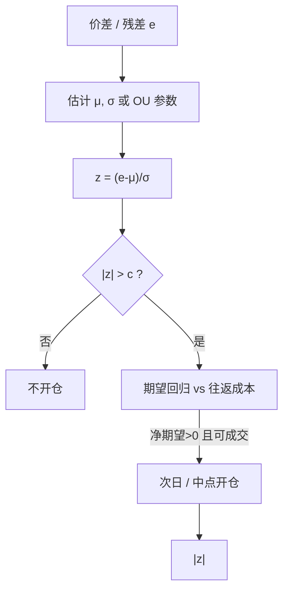

# Z-score 开仓

    
形成期价差偏离两个历史标准差则开仓：这是一条可复制的阈值规则，不是对均衡存在的检验，也不是扣除成本后的最优进入边界。

    <footer>—— Gatev, Goetzmann & Rouwenhorst, Pairs Trading, Review of Financial Studies, 2006</footer>

[上一课](/quant/etf-arb)把 ETF 套利写成 AP 申赎把二级价格拉向可复制篮子；偏离含信息领先与口径陈旧，只有可执行带外的部分才值得评估。申赎是制度收敛，统计套利的开仓则几乎总是某种标准化偏离。缺口是 Z-score 这一滤波器：窗口、均值/波动定义与阈值 $c$ 共同决定换手和净期望，不是单一的「两倍标准差魔法」。GGR 用形成期固定 $\sigma$；OU/Kalman 用均衡波动与时变均值。本课写这些选择如何改写期望。不重讲 AP 约束。

## 问题

设价差或残差为 $e_t$。定义

$$
z_t=\frac{e_t-\hat\mu_t}{\hat\sigma_t}.
$$

规则：$z_t>c$ 做空价差，$z_t<-c$ 做多， $|z_t|<c_{\mathrm{exit}}$ 平仓。问题有三层。第一，$\hat\mu,\hat\sigma$ 用哪一段历史：形成期固定（GGR）还是滚动（常见 20–60 日）。滚动会让阈值追踪新波动，危机里 $\hat\sigma$ 膨胀，$|z|$ 回落，策略在最该停手或最该反向供给流动性时关掉信号——这不一定错，但必须当成机制而不是 bug。第二，$e_t$ 若不是平稳的，见[协整破裂](/quant/cointegration-break)，$z_t$ 仍会反复穿越 $c$，那是单位根路径的局部波动，不是回归。第三，截面上同时监控 $N$ 对，$P(\max |z|>c)$ 远大于单对的名义水平，开仓次数被极值驱动。

Elliott 等人把配对写成可观测价差加隐状态的均衡水平，过滤后的偏离才标准化。这比朴素 $z$ 更接近「对时变均值开仓」，但也把模型误设变成开仓理由：卡尔曼增益错了，Z-score 会系统性偏斜。

### 阈值 $c$ 不是风险中性的最优停时

在 OU 假设下，可以写出最优进入边界与持有期的权衡：更宽的 $c$ 提高每次平均利润、降低成交次数。真实目标函数必须减掉每次往返的有效价差与冲击，于是最优 $c$ 随成本上升而变宽。样本内用夏普去挑 $c\in\{1,1.5,2,2.5\}$，等价于对同一噪声做多次检验。Gatev 原文固定 $c=2$ 且用形成期 $\sigma$，部分就是为了少给自己挑选空间。把 $c$ 写成「两倍标准差因为 95%」是把正态分位数误当成经济最优。

$z$ 对 $\hat\sigma$ 的估计误差极敏感。几十个日频点的样本标准差本身波动很大，阈值时而极松时而极紧。用同一窗口估均值与标准差，还会让 $e_t$ 进入 $\hat\mu$，削弱当期信号——有人改用滞后窗口，又引入额外滞后超参。

## 方法

把规则拆成可审计的零件。价差定义：对数比、回归残差、还是标准化价格差，三者的 $z$ 不可互换。位置与尺度：均值用样本均值还是 EWMA；波动用标准差、分位数极差还是 OU 的 $\sigma_{\mathrm{eq}}=\sigma/\sqrt{2\kappa}$。Avellaneda–Lee 用均衡波动，使 $z$ 在不同半衰期的名字之间可比；用原始 $\mathrm{sd}(e)$ 则会让慢回归的对看起来「更少开仓」。开仓与平仓不对称：$c_{\mathrm{exit}}<c$ 造成滞后，减少抖动，但拉长持有、增加借券与破裂暴露。

执行时钟。用收盘 $z$ 在次日开盘成交，避免用同一根 bar 的收盘价既当信号又当成交。盘中 $z$ 需要同步的中点，并处理跳空：隔夜 $e$ 的跳跃会让 $z$ 一开盘就过阈值，此时流动性最差。多对组合要对 $z$ 做截面标准化或排名，否则高波动对永远占满名额。更干净的是限制同时持有对数，并按 $|z|$ 与 ADV 分配权重，而不是过线就等权满仓。

### 分布、跳跃与伪平稳

残差有肥尾与跳跃。正态 $c=2$ 对应的尾部概率在真实数据里更大，开仓比名义更频繁，或一旦开仓偏离更大。用稳健 $\hat\sigma$（如 MAD）会改变 $c$ 的含义，必须重校成本。跳跃若来自公司事件，Z-score 开仓会把事件驱动当成均值回归。过滤应在信号之前：停牌、涨跌停、分红、指数调整日不产生新开仓。伪平稳——短期样本里单位根看起来像高 $\kappa$ 的 OU——会让 $z$ 频繁回归，样本内夏普虚高，样本外第一次破裂就回吐。

截面上对所有对的 $z$ 做多重检验修正（Bonferroni 或错误发现率）会减少开仓、提高平均质量，也会把策略变成「只做极端尾部」，容量更差、冲击更大。修正不是免费的 alpha 纯化。

## 机制

在真实均值回归且成本为零时，$z$ 过阈值是库存偏离过大、期望有负漂移的时刻。有成本时，只有 $|z|$ 隐含的期望回归超过往返摩擦才有正的净期望，见[交易成本后的可交易性](/quant/net-edge)。拥挤时，许多账户用相近窗口算 $z$，阈值变成协调装置：大家在同一分钟开仓，价差瞬时被推回，$z$ 刚过 $c$ 就没了边缘，实现的是冲击而不是回归。反过来，平仓阈值 $c_{\mathrm{exit}}$ 也会拥挤，回归的最后一段被抢光，你的出场落在流动性更差的一侧。

滚动 $\hat\sigma$ 有顺周期。波动上升时策略降杠杆（$|z|$ 变小），波动下降时加杠杆。这与[仓位与 Kelly](/quant/kelly-sizing) 的波动缩放同方向，但此处缩放来自信号定义本身，不是显式风险预算。若残差在高压期正自相关（平仓螺旋），$z$ 会在亏损方向上维持开仓状态更久，因为均值也被拉过去——EWMA 均值追价格，是把破裂当成新均衡，有时对、有时把止损推迟到更大亏损。

### 与距离法、PCA 残差的接口

GGR 的 $c=2$ 绑在形成期 $\sigma$ 上，交易期 $\sigma$ 变了也不改阈值，这是一种反周期性：危机里更容易开仓。滚动 Z-score 相反。PCA 残差的 $z$ 在因子模型重估日会跳，开仓可能来自载荷旋转而不是经济偏离。规格必须冻结：因子更新频率、对齐方法、以及更新日是否禁止新开仓。否则回测里的「Z-score 信号」混进了模型维护日历。

## 边界与工程取舍

不要把 $c$ 的样本内网格搜索结果写成理论最优。不要在 $z$ 上叠加 MACD、布林带宽度再声称仍是 GGR 或 Avellaneda–Lee。A 股涨跌停使 $e_t$ 截断，$\hat\sigma$ 低估，开盘后 $z$ 爆炸式触发。卖空约束下，$z>c$ 的空头腿经常缺一腿，策略变成单边，Z-score 的「中性」只存在于信号文件里。

报告至少包括：不同 $c$ 下的换手、命中率、平均持有期、最大不利偏移、以及扣有效价差后的期望。若只有高 $c$ 才有正净期望，容量就是那几次极端偏离时的 ADV，不是全样本平均对数。时间止损与 $z$ 规则同时存在时，要声明谁优先，见[止损与时间止损](/quant/statarb-stops)。

OU 的 $z$ 用 $\sigma/\sqrt{2\kappa}$ 标准化，估计 $\kappa$ 接近零时均衡波动爆炸，信号消失——这其实是一件好事：它拒绝在近单位根上开仓。若你改用短窗口标准差「救回」信号，等于关掉这道保险。

## 小结

- Z-score 开仓把偏离标准化成阈值规则；窗口、均值/波动定义与 $c$ 共同决定换手和净期望，不是单一的「两倍标准差魔法」。
- GGR 用形成期固定 $\sigma$ 与 $c=2$；OU/Kalman 用均衡波动与时变均值。两者样本内表现不可互换引用。
- 非平稳、肥尾、多重配对与拥挤使名义阈值失效；成本上升时应加宽 $c$，而不是用夏普网格去收窄。
- 滚动 $\sigma$ 具有顺周期；形成期固定 $\sigma$ 更反周期。必须显式选择并做压力测试。
- 出处：Gatev, Goetzmann and Rouwenhorst, *RFS*, 2006；Elliott, Van Der Hoek and Malcolm, *Quantitative Finance*, 2005；Avellaneda and Lee, *Quantitative Finance*, 2010。
