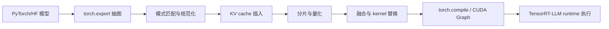

## 核心结论

TensorRT-LLM 的图优化，核心不是“把 PyTorch 换成另一个框架”，而是把**推理相关的脏活**从模型代码里拆出来，交给 AutoDeploy 这类图编译流水线统一处理。这里的“图”就是计算步骤的有向图，节点是算子，边是张量流向。模型作者仍然写标准 PyTorch，部署侧再自动补上 KV cache、参数分片、量化、融合、CUDA Graph 捕获这些推理专用机制。

对零基础读者，最直接的理解是：AutoDeploy 像一个“图级翻译官”。你提交的是训练友好的 PyTorch 模型，它输出的是运行友好的推理图。模型本身不必手工重写成大量工程化推理代码，部署流程从“人肉改模型”变成“模型保持不动，编译器加优化”。

这件事成立的前提是：大模型推理的大部分收益并不来自数学公式变化，而来自**执行方式变化**。同样是注意力和 MLP，如果没有 KV cache、没有 fused kernel、没有分片、没有 runtime 调度，GPU 会长期卡在访存、同步和小算子开销上。图优化的目标，就是把这些离散开销压缩成更接近硬件偏好的执行形态。

下面这张表可以先建立直觉。数据不是普适常数，而是“图优化为什么重要”的证据类型。

| 对比项 | 标准 PyTorch/手工路径 | AutoDeploy 图优化路径 |
|---|---:|---:|
| 模型接入成本 | 高，需要补推理逻辑 | 低，优先复用原始 PyTorch |
| KV cache 接入 | 常需手工写接口 | 自动插入/接入缓存管理 |
| 多 GPU 分片 | 常需显式实现 | 由图变换和配置驱动 |
| 算子融合 | 依赖手工 kernel 选型 | 由模式匹配和后端完成 |
| 典型收益 | 可工作，但调优周期长 | 更快达到可上线基线性能 |
| 官方公开案例 | Nemotron 3 Nano 手工基线 | 单卡 B200 上 FP8 达到每用户最高约 350 tokens/s |

---

## 问题定义与边界

问题定义很具体：**如何把“模型定义”与“推理优化”解耦**。这里的“解耦”是指，同一个模型实现同时服务于训练、评估和部署，而不是为了部署再维护一份改写版。这样做的原因很现实：模型结构更新很快，手工重写推理图的成本越来越难摊薄。

AutoDeploy 解决的是这类问题：

- 输入是标准 PyTorch 或 Hugging Face 模型
- 中间用 `torch.export` 抽取统一图表示
- 再对图做一组可复用的部署变换
- 最后交给 TensorRT-LLM runtime 执行

它更适合的对象，是**结构相对规则的生成式模型**。规则的意思不是简单，而是主体结构能被识别成一组稳定模式，比如注意力、RoPE、MLP、MoE、状态空间层。首次出现的“RoPE”是旋转位置编码，可以理解成一种把位置信息写进向量的方法。首次出现的“MoE”是混合专家模型，可以理解成只激活部分子网络以节省计算的一种结构。

支持边界可以先用一张列表看清：

**更适合**
- 标准 Transformer 变体，如 Llama、Qwen、Nemotron 一类
- 兼容 `AutoModelForCausalLM` 的文本生成模型
- 一部分 VLM、SSM、线性注意力模型的早期支持场景
- 需要快速把研究模型接入推理服务的团队

**不适合或需要额外处理**
- 复杂控制流很多的模型
- 大量自定义 op 且未按接口暴露的模型
- 强依赖稀疏机制、特殊路由或非常规缓存语义的模型
- 需要完全可控、逐层人工调度的极致性能场景

这里要特别校正一个常见误解：很多人把 AutoDeploy 理解成“自动导出一个传统 TensorRT `.plan` 引擎”。截至官方 2026-02-09 的公开资料，重点描述的是**生成可在 TensorRT-LLM runtime 中执行的 inference-optimized graph**，而不是把它简单等同于老式离线 engine 导出流程。两者目标相关，但工程形态不完全一样。

---

## 核心机制与推导

可以把图优化形式化写成：

$$
G_{tgt}=\mathcal{T}(G_{src}), \quad 
\mathcal{T}=\{\tau_{kv}, \tau_{shard}, \tau_{quant}, \tau_{fusion}, \tau_{cuda\_graph}\}
$$

其中：

- $G_{src}$ 是原始 PyTorch 导出的计算图
- $G_{tgt}$ 是部署后目标图
- $\tau_{kv}$ 是 KV cache 插入
- $\tau_{shard}$ 是参数或计算分片
- $\tau_{quant}$ 是量化
- $\tau_{fusion}$ 是融合
- $\tau_{cuda\_graph}$ 是 CUDA Graph 捕获

“KV cache”首次出现时可以理解成：把历史 token 的 Key 和 Value 保存下来，后续解码不再重复算过去的部分。对自回归生成，若第 $t$ 步都重算前 $t-1$ 步，复杂度会非常差；有了缓存，解码阶段每步主要处理新增 token。粗略看，注意力计算会从“反复重做历史”变成“增量追加历史”。

如果只看解码阶段，单层自注意力的历史重算代价可粗略写成：

$$
\text{Cost}_{\text{no-cache}}(t) \propto t \cdot d,
\qquad
\text{Cost}_{\text{cache}}(t) \propto d + t \cdot d_{\text{read}}
$$

这里 $d$ 是隐藏维度规模，$d_{\text{read}}$ 强调缓存后的主要瓶颈往往从重复计算转向缓存读取与带宽。公式不是精确硬件模型，但足够说明为什么 KV cache 是第一优先级优化。

图优化的真正关键，不是“多做几个 pass”，而是**先把异构实现规范化，再做下游优化**。同样是 attention，不同模型可能写成不同张量变形、转置、缩放、softmax 组合。编译器先做模式匹配，把它们收敛到统一语义节点，例如规范成一个 attention custom op。这样后续才容易统一插缓存、选 kernel、做调度。

可以把顺序画成下面这样：



**玩具例子**

假设你写了一个最简单的注意力层，图里是 `matmul -> scale -> softmax -> matmul`。对训练代码这是自然表达，但对部署并不理想。AutoDeploy 会先识别“这四步其实是一个 attention 模式”，把它规范成一个统一节点；随后它才能说：“这个节点支持缓存”“这个节点支持 paged attention”“这个节点适合用哪套 kernel”。

**真实工程例子**

NVIDIA 在 2026-02-09 的技术博客里给出的 Nemotron-Flash 和 Nemotron 3 Nano 案例，说明了这套机制的工程价值。Nemotron-Flash 这种混合架构同时包含 softmax attention、state-space layers、linear attention。如果继续沿用“每个新模型都手工重写推理后端”的路径，接入成本会非常高；而图规范化后，新层类型可以作为增量扩展接入已有编译 pass，而不是整条部署链重写。

---

## 代码实现

先看一个**可运行的玩具 Python 例子**。它不依赖 TensorRT-LLM，本质是模拟“原始图经过若干变换后，变成可部署图”的过程。

```python
from dataclasses import dataclass, field

@dataclass
class Graph:
    ops: list[str] = field(default_factory=list)
    flags: dict = field(default_factory=dict)

def insert_kv_cache(g: Graph) -> Graph:
    if "attention" in g.ops and "kv_cache" not in g.ops:
        idx = g.ops.index("attention") + 1
        g.ops.insert(idx, "kv_cache")
    g.flags["kv_cache"] = True
    return g

def shard(g: Graph, tp: int) -> Graph:
    g.flags["tensor_parallel"] = tp
    return g

def quantize(g: Graph, mode: str) -> Graph:
    g.flags["quant"] = mode
    return g

def fuse(g: Graph) -> Graph:
    fused = []
    i = 0
    while i < len(g.ops):
        if i + 1 < len(g.ops) and g.ops[i] == "layernorm" and g.ops[i + 1] == "linear":
            fused.append("fused_ln_linear")
            i += 2
        else:
            fused.append(g.ops[i])
            i += 1
    g.ops = fused
    g.flags["fused"] = True
    return g

def cuda_graph(g: Graph) -> Graph:
    g.flags["cuda_graph"] = True
    return g

src = Graph(ops=["embedding", "layernorm", "linear", "attention", "linear", "lm_head"])
tgt = cuda_graph(fuse(quantize(shard(insert_kv_cache(src), tp=2), mode="fp8")))

assert "kv_cache" in tgt.ops
assert "fused_ln_linear" in tgt.ops
assert tgt.flags["tensor_parallel"] == 2
assert tgt.flags["quant"] == "fp8"
assert tgt.flags["cuda_graph"] is True
print(tgt)
```

这个玩具例子表达的不是具体 API，而是部署思路：图优化是**一组可组合的图变换**，而不是某一个神秘黑盒。

再看贴近真实流程的伪代码。注意，这里强调的是“接入思路”，不是承诺所有参数名与版本完全一致；真实参数应以你当下安装版本的官方文档为准。

```python
from tensorrt_llm import LLM

model = LLM(
    model="TinyLlama/TinyLlama-1.1B-Chat-v1.0",
    backend="pytorch",
    auto_deploy=True,
    tensor_parallel_size=1,
    dtype="float16",
)

outputs = model.generate(
    prompts=["Explain KV cache in one sentence."],
    max_new_tokens=32,
)

assert len(outputs) == 1
```

理解这段代码时要抓住两点：

1. 模型定义仍然来自原始 Hugging Face/PyTorch。
2. AutoDeploy 介入的是**部署阶段**，不是训练阶段。

常见配置可以抽象成下面这张表：

| 配置项 | 作用 | 常见取值 | 主要影响 |
|---|---|---|---|
| `attn_backend` | 注意力后端 | `flashinfer` 等 | 注意力 kernel 与吞吐 |
| `tensor_parallel_size` | 张量并行分片数 | 1, 2, 4, 8 | 多卡扩展与通信成本 |
| `quant` / `dtype` | 量化或精度 | FP16 / BF16 / FP8 / INT8 | 显存、吞吐、精度风险 |
| `runtime` | 执行时后端 | `trtllm` | 是否进入 TensorRT-LLM runtime |
| `compile_backend` | 图编译后端 | `torch-compile` 等 | 编译时间与运行时优化 |
| `kv_cache` 相关策略 | 缓存接入方式 | 默认或高级配置 | 长上下文性能与稳定性 |

真实工程例子里，团队不会先手写 CUDA kernel，再想办法把模型塞进去；更现实的流程是：

1. 先验证模型能被 `torch.export` 抽出稳定图。
2. 再看关键块是否能被识别成规范节点。
3. 再开启 KV cache、量化、分片。
4. 最后用 benchmark 验证 tokens/s、首 token 延迟、显存占用。

---

## 工程权衡与常见坑

自动化部署的最大收益，是把“首次可上线时间”显著缩短；最大代价，是你把一部分控制权交给编译器和 runtime。对标准 Transformer，这通常是赚的；对高度非标准模型，未必。

常见问题可以直接看表：

| 问题 | 原因 | 规避方式 |
|---|---|---|
| 图抽取失败 | `torch.export` 无法稳定处理某些控制流或动态行为 | 先简化前向逻辑，必要时分段导出 |
| 注意力未被识别 | 实现方式偏离常见模式，模式匹配失效 | 改写为更标准的张量表达，或注入 custom op |
| KV cache 接口不兼容 | 某层缓存语义与 runtime 期望不一致 | 先验证单层缓存协议，再接整图 |
| 量化后精度掉太多 | 标度选择不合适，校准样本不足 | 先从 BF16/FP16 基线开始，再逐步切 FP8/INT8 |
| 多卡收益不升反降 | 分片后通信开销高，batch 不够大 | 结合并行度和请求形态重新选 TP/PP |
| CUDA Graph 收益不稳定 | 输入形状变化大，图捕获条件不满足 | 对固定 decode 场景开启，动态场景谨慎使用 |

最常见的错误判断是：只要是“自动图优化”，就一定比手工好。这不成立。自动化的价值主要在**平均效率**和**接入速度**，不是在所有模型上都碾压最强手工优化。

举一个真实工程中的典型坑：某个 MoE 模型的路由逻辑用了自定义符号，AutoDeploy 无法直接识别成规范专家路由节点。结果不是“整个系统没价值”，而是工程师需要改成分段策略：先让主干 Transformer 部分走自动图优化，路由相关块先保留手工实现，待 custom op 接口稳定后再合并。这种“局部自动、局部手工”的折中，往往比全量重写更划算。

---

## 替代方案与适用边界

如果把方案放到同一坐标系里比较，本质是在“控制力”和“交付速度”之间选点。

| 方案 | 优点 | 缺点 | 适用场景 |
|---|---|---|---|
| AutoDeploy + TensorRT-LLM | 接入快，保留 PyTorch 单一模型定义，自动吃到 KV cache/分片/融合/runtime 优化 | 受支持边界约束，遇到非标准结构需回退 | 标准或近标准 Transformer，追求快速上线 |
| 手工 TensorRT / 手工推理重写 | 控制力最强，可为特定模型压榨极限性能 | 开发维护成本最高，模型一变就要重做 | 核心业务模型、超大规模高价值部署 |
| Triton Server | 服务化成熟，便于统一部署与观测 | 不直接等于图优化器，仍需底层推理后端配合 | 多模型服务治理、统一推理入口 |
| OpenVINO / 其他后端 | 对特定硬件或生态友好 | 与 NVIDIA 栈的最优路径不同 | 非 NVIDIA 环境，或已有既定技术栈 |

一句话判断边界：

- 如果你的模型主体是标准 attention + MLP + LayerNorm，AutoDeploy 很值得优先试。
- 如果你的模型包含大量自定义控制流、稀疏调度、图外状态管理，它就不是“交给编译器就完事”的问题。
- 如果你要的是**最快拿到可上线性能**，AutoDeploy 通常优于从零手工重写。
- 如果你要的是**特定模型的绝对峰值性能**，手工 TensorRT 路线仍然有空间。

这里“LayerNorm”首次出现时可以理解成一种把激活值重新拉回稳定范围的归一化层。它本身不是部署优化，但它和 MatMul、attention 相邻时，常是融合优化的目标。

---

## 参考资料

1. NVIDIA Technical Blog, *Automating Inference Optimizations with NVIDIA TensorRT LLM AutoDeploy*  
   链接：https://developer.nvidia.com/blog/automating-inference-optimizations-with-nvidia-tensorrt-llm-autodeploy/  
   用途：看 AutoDeploy 的整体架构、Nemotron 3 Nano 的性能案例、Nemotron-Flash 的工程接入价值。文中给出 2026-02-09 发布的官方案例，包括单卡 B200 上 FP8 每用户最高约 350 tokens/s 的数字。

2. TensorRT-LLM 官方特性页, *AutoDeploy (Beta)*  
   链接：https://nvidia.github.io/TensorRT-LLM/features/auto_deploy/auto-deploy.html  
   用途：看官方对 AutoDeploy 的功能定位，特别是“从 PyTorch 提取图，再自动施加 KV cache、分片、量化等图变换”的定义。

3. TensorRT-LLM Torch 文档, *AutoDeploy*  
   链接：https://nvidia.github.io/TensorRT-LLM/torch/auto_deploy/auto-deploy.html  
   用途：看 prototype 状态、支持矩阵、示例入口 `build_and_run_ad.py`、runtime 集成方式，以及当前功能仍在快速变化这一边界说明。

4. TensorRT-LLM Torch 文档, *Support Matrix*  
   链接：https://nvidia.github.io/TensorRT-LLM/torch/auto_deploy/support_matrix.html  
   用途：查当前官方验证过的模型范围，确认自己的模型是不是落在支持甜区，而不是靠猜。
