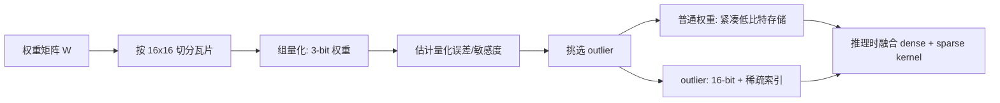

## 核心结论

SpQR 的核心不是“把所有权重都压到 3 bit”，而是把**大多数可安全压缩的权重**和**少数会显著放大量化误差的离群权重**分开处理。这里的“离群权重”可以先理解为：数值不一定最多，但一旦量化错了，模型输出会明显变差的那一小部分参数。

它的典型做法是：对权重矩阵按 `16×16` 瓦片切分，在瓦片内部做双层的 3-bit 组量化，再把少量高影响力 outlier 单独用更高精度保存。这样平均可做到约 `4.6–4.7 bit/参数`，但精度接近原始模型。[Hugging Face 文档](https://huggingface.co/docs/transformers/v4.49.0/en/quantization/spqr)明确给出 `16x16 tiled bi-level group 3-bit quantization structure with sparse outliers`；[SpQR 论文页面](https://research.yandex.com/publications/sp-qr-a-sparse-quantized-representation-for-near-lossless-llm-weight-compression)则给出 33B 模型在单张 24 GB 消费级 GPU 上运行、压缩超过 4 倍且推理比 fp16 快约 15% 的结果。

这说明 SpQR 的价值不只是“压得更小”，而是它抓住了一个部署事实：**真正阻碍低比特量化落地的，不是平均误差，而是少量高敏感权重造成的局部灾难性误差。**

| 方案 | 平均 bit/参数 | 是否保留 outlier | 是否依赖 sparse kernel | 典型推理表现 |
|---|---:|---|---|---|
| fp16 | 16 | 否 | 否 | 基线 |
| 纯 4-bit 稠密量化 | 约 4 | 否 | 否 | 通常更省显存，但精度可能下降 |
| 纯 3-bit 稠密量化 | 约 3 | 否 | 否 | 更激进，精度风险更高 |
| SpQR | 约 4.6–4.7 | 是 | 是，效果更好 | 在合适 kernel 上可快于 fp16 |

---

## 问题定义与边界

问题可以定义得很具体：

给定一个已经训练好的大语言模型权重矩阵 $W$，希望把它压缩到消费级显存能承受的范围，同时满足三条约束：

| 约束项 | 目标 |
|---|---|
| 硬件边界 | 单卡 24 GB 左右显存可部署 7B 到 33B 级模型 |
| 精度边界 | perplexity 或下游任务精度接近原模型，不能出现明显退化 |
| 存储边界 | 平均位宽尽量控制在 3 到 5 bit/参数区间 |

如果只做“统一低比特量化”，常见问题是：大部分权重确实能被很好压缩，但少数敏感权重会把误差放大。这在 [SpQR 论文](https://research.yandex.com/publications/sp-qr-a-sparse-quantized-representation-for-near-lossless-llm-weight-compression) 里被总结为 3 到 4 bit 量化常带来中等到较高的精度损失，尤其在 `1B~10B` 这类更适合边缘部署的模型上更明显。

边界也要说清楚：

1. SpQR 主要压缩的是**权重**，不是训练态的优化器状态，也不是所有激活。
2. 它依赖专门的解码和推理 kernel；如果运行环境没有对应支持，压缩后未必更快。
3. 它更适合**内存瓶颈明显**、而且**离群权重确实主导量化误差**的场景；如果硬件本身对纯 4-bit 稠密 kernel 支持极强，SpQR 的优势会缩小。

真实工程例子是 33B 的 LLaMA/Falcon：按 fp16 粗算，权重大约需要 $33 \times 10^9 \times 2 \approx 66$ GB，仅权重就远超 24 GB 显存；而若平均压到 `4.6 bit`，理论存储约是：

$$
33 \times 10^9 \times \frac{4.6}{8} \approx 18.98 \text{ GB}
$$

这时模型才第一次进入“单卡可装下”的区间。这个数量级变化，才是 SpQR 有工程意义的原因。

---

## 核心机制与推导

SpQR 可以拆成三个步骤理解：

1. 先把权重矩阵分成 `16×16` 小瓦片。
2. 对瓦片里“大多数正常权重”做低比特组量化。
3. 把“量化后会造成大误差的少量权重”抽出来，单独高精度保存。

这里“组量化”可以先理解为：不是每个权重各自找一个缩放系数，而是一组权重共享缩放与零点，减少元数据开销。

平均位宽可写成一个非常直观的式子：

$$
B = \frac{(N - N_{\text{outlier}})\times b + N_{\text{outlier}}\times 16 + C}{N}
$$

其中：

- $N$ 是总参数数目。
- $N_{\text{outlier}}$ 是被抽出来单独存储的参数数目。
- $b$ 是普通量化权重位宽，SpQR 常用 `3`。
- $C$ 是缩放因子、零点、索引等元数据总成本。

很多介绍会先写简化版：

$$
B \approx (1-r)\times b + r\times 16
$$

其中 $r = N_{\text{outlier}} / N$。这个式子不是精确存储公式，但足够说明核心权衡：`r` 增大，精度通常更稳，但压缩率下降。

### 玩具例子

假设有 4 个权重：

$$
[0.12,\ -0.08,\ 3.7,\ -3.6]
$$

如果强行全部做统一 3-bit 量化，后两个大值会拉大整个量化区间，导致前两个小值分辨率非常差。SpQR 的做法是：

- 把 `0.12`、`-0.08` 作为普通权重，用 3-bit 量化。
- 把 `3.7`、`-3.6` 视为 outlier，直接保留高精度。

则总位宽近似为：

$$
2 \times 3 + 2 \times 16 = 38 \text{ bit}
$$

而全 16-bit 需要：

$$
4 \times 16 = 64 \text{ bit}
$$

这不是最优压缩，但它揭示了机制：**少数大误差源用高精度兜底，让大多数参数继续享受低比特压缩。**

### 为什么它成立

量化误差不是平均分布的。对某些层、某些通道、某些位置，权重一旦被粗糙离散化，误差会沿矩阵乘法传播，最后放大到 logits。SpQR 的关键判断是：**不是所有高数值权重都必须保留，而是那些对量化误差最敏感的权重必须保留。**

论文与实现仓库都体现了这一点：量化时会结合校准数据，使用分组、重排、阈值等策略识别 outlier，并在推理端用稀疏格式保存与重建。官方仓库还提供了 `csr`、`ptcsr` 等稀疏存储策略选择，说明这些 outlier 在工程上确实被当作稀疏矩阵处理。[GitHub 仓库](https://github.com/Vahe1994/SpQR)

下面用流程图表示：



---

## 代码实现

先看最容易跑通的工程路径：直接加载 Hugging Face 上已经量化好的 SpQR 模型。官方文档示例是：

```python
from transformers import AutoTokenizer, AutoModelForCausalLM
import torch

model_id = "elvircrn/Llama-2-7b-SPQR-3Bit-16x16-red_pajama-hf"

model = AutoModelForCausalLM.from_pretrained(
    model_id,
    torch_dtype=torch.half,
    device_map="auto"
)
tokenizer = AutoTokenizer.from_pretrained(model_id)
```

这段代码的含义很简单：模型权重已经是 SpQR 格式，`transformers` 在加载时负责识别并按对应格式解码。[参考](https://huggingface.co/docs/transformers/v4.49.0/en/quantization/spqr)

下面给一个可运行的 Python 玩具实现。它不是论文原版算法，只是用最小例子说明“普通量化 + outlier 高精度保留”的存储思想。

```python
import math

def uniform_quantize(xs, bits=3):
    qmax = 2 ** bits - 1
    xmax = max(abs(x) for x in xs) if xs else 1.0
    scale = xmax / (qmax / 2) if xmax != 0 else 1.0

    q = []
    for x in xs:
        v = round(x / scale)
        v = max(-(qmax // 2), min(qmax // 2, v))
        q.append(v)
    return q, scale

def spqr_toy_compress(weights, outlier_threshold=2.0, bits=3):
    normal = []
    outliers = {}
    for i, w in enumerate(weights):
        if abs(w) >= outlier_threshold:
            outliers[i] = w
        else:
            normal.append((i, w))

    qvals, scale = uniform_quantize([w for _, w in normal], bits=bits)

    packed = {
        "bits": bits,
        "scale": scale,
        "normal_idx": [i for i, _ in normal],
        "normal_q": qvals,
        "outliers": outliers,
    }
    return packed

def spqr_toy_decompress(packed, n):
    result = [0.0] * n
    scale = packed["scale"]

    for idx, q in zip(packed["normal_idx"], packed["normal_q"]):
        result[idx] = q * scale

    for idx, w in packed["outliers"].items():
        result[idx] = w

    return result

weights = [0.12, -0.08, 3.7, -3.6]
packed = spqr_toy_compress(weights, outlier_threshold=2.0, bits=3)
restored = spqr_toy_decompress(packed, len(weights))

assert len(restored) == 4
assert math.isclose(restored[2], 3.7, rel_tol=0, abs_tol=1e-9)
assert math.isclose(restored[3], -3.6, rel_tol=0, abs_tol=1e-9)
assert abs(restored[0]) <= 0.5 and abs(restored[1]) <= 0.5
```

如果把它翻译成更接近工程实现的伪代码，大致是：

```text
for each weight matrix W:
    tile W into 16x16 blocks
    for each block:
        split block into quant groups
        estimate scale/zero
        quantize most weights to 3-bit
        score quantization sensitivity
        select top-sensitive entries as outliers
        store:
            dense_lowbit_payload
            tile/group metadata
            sparse_outlier_values
            sparse_outlier_indices
during inference:
    decode lowbit dense part
    decode sparse outlier part
    fused kernel computes y = Wx
```

真实工程里，最难的不是“压缩逻辑”，而是**推理时怎么高效把低比特稠密部分和稀疏高精度部分合并计算**。这也是为什么 SpQR 不能只看论文公式，必须看推理端 kernel 是否成熟。

---

## 工程权衡与常见坑

第一类权衡是 **outlier 比例**。

- 比例太低：压缩率高，但精度可能掉。
- 比例太高：高精度保留太多，索引和稀疏调度成本会上升，最后既不够小，也未必更快。

可以用一个简化判断理解：

| outlier 比例 | bit/参数趋势 | 精度趋势 | 速度风险 |
|---|---|---|---|
| 0% | 最低 | 最差 | 稠密 kernel 最简单 |
| 1%~3% | 略升 | 常是有效折中 | 需要良好 sparse 支持 |
| 10% 以上 | 明显升高 | 可能更稳 | 稀疏开销开始吃掉收益 |
| 20% 左右或更高 | 接近失去压缩意义 | 不一定继续改善 | 常见调度退化 |

第二类权衡是 **kernel 支持**。

SpQR 的推理优势来自两部分一起成立：

1. 权重更小，显存带宽压力下降。
2. 稀疏 outlier 能被专门 kernel 高效处理。

如果只有第一条，没有第二条，可能出现一个常见坑：理论存储变小了，但每次 matmul 之前都要做复杂解码或 kernel 切换，最终吞吐反而下降。论文页面强调它提供了高效 GPU inference algorithm，这恰好说明“格式设计”和“运行时实现”是同一件事的两面。[参考](https://research.yandex.com/publications/sp-qr-a-sparse-quantized-representation-for-near-lossless-llm-weight-compression)

第三类坑是 **把 SpQR 当成通用最优解**。

它并不是“永远优于 4-bit”。如果你的设备对纯 4-bit 稠密矩阵乘已经高度优化，而对稀疏路径支持弱，那么全 4-bit 可能反而更稳、更简单。

可以把经验规则写成 if-else：

- 如果显存是第一瓶颈，且目标模型在 fp16 下根本放不进单卡，优先考虑 SpQR。
- 如果已有成熟 sparse+dense 融合 kernel，SpQR 更可能同时拿到容量和速度收益。
- 如果部署平台只对稠密低比特友好，优先评估纯 4-bit。
- 如果量化后 perplexity 明显恶化，先增加 outlier 比例，再看是否值得继续保留 SpQR 结构。
- 如果 outlier 比例已经高到接近破坏压缩收益，应重新评估模型、分组大小或改用别的方法。

---

## 替代方案与适用边界

把 SpQR 放到量化方案谱系里看，它属于“**低比特主干 + 高精度例外项**”路线。替代方案主要有两类。

第一类是**纯稠密低比特量化**。优点是实现简单，硬件兼容性通常更好；缺点是对误差更敏感，尤其是小模型或分布尖锐的层。你可以把它理解为“统一规则治理全部参数”，而 SpQR 是“允许少数参数例外”。

第二类是**继续保留 4-bit 稠密推理，再配合蒸馏、LoRA 或结构优化**。这种方案不一定压得比 SpQR 更狠，但系统复杂度可能更低，适合已有稳定 4-bit 基础设施的团队。

| 方案 | 平均位宽 | 需要 sparse kernel | 优点 | 适用边界 |
|---|---:|---|---|---|
| fp16 | 16 | 否 | 最稳、生态最全 | 显存充足 |
| 纯 4-bit 稠密量化 | 约 4 | 否 | 实现简单、硬件兼容较强 | 对少量精度损失可接受 |
| 纯 3-bit 稠密量化 | 约 3 | 否 | 压缩更激进 | 容易掉精度 |
| SpQR | 约 4.6–4.7 | 通常需要 | 精度更稳，部署大模型更现实 | 显存紧张且有稀疏支持 |
| 4-bit + 蒸馏/LoRA | 约 4 | 否 | 训练后补偿空间大 | 有额外调参预算 |

一个实用决策树是：

1. 你的部署是否被显存卡死？
2. 你的平台是否支持高效 sparse kernel？
3. 你的模型是否在纯 4-bit/3-bit 下出现不可接受的精度下降？

如果这三个问题的答案分别是“是、是、是”，SpQR 通常值得优先试。

---

## 参考资料

1. Hugging Face Transformers 文档，SpQR 量化介绍与加载示例：<https://huggingface.co/docs/transformers/v4.49.0/en/quantization/spqr>
2. Hugging Face Transformers 主文档中的 `SpQRConfig`，说明当前支持的 `bits=3`、`beta1=16`、`beta2=16`：<https://huggingface.co/docs/transformers/main/en/main_classes/quantization>
3. ICLR 2024 论文页面，`SpQR: A Sparse-Quantized Representation for Near-Lossless LLM Weight Compression`：<https://research.yandex.com/publications/sp-qr-a-sparse-quantized-representation-for-near-lossless-llm-weight-compression>
4. Hugging Face Papers 页面，对 arXiv:2306.03078 的摘要与链接汇总：<https://huggingface.co/papers/2306.03078>
5. 官方实现仓库 `Vahe1994/SpQR`，包含量化脚本、转换脚本、`csr/ptcsr` 稀疏存储与推理 demo：<https://github.com/Vahe1994/SpQR>
