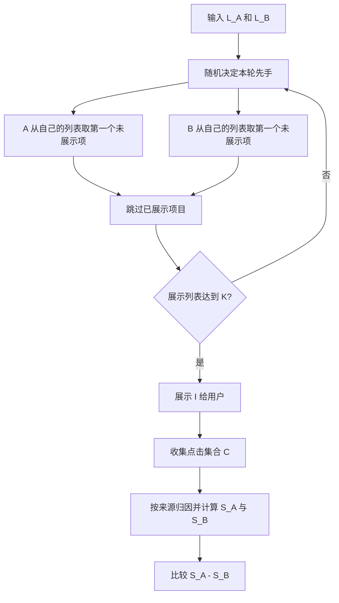
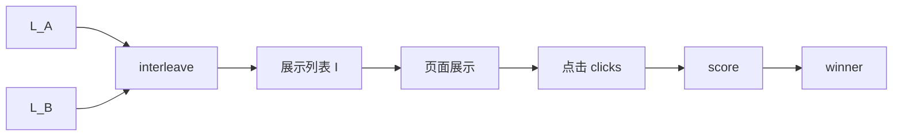

## 核心结论

Interleaving 是一种在线排序评估方法：把两个排序器 `A` 和 `B` 的结果按规则混合成同一条展示列表，让同一批用户的点击直接归因给对应排序器，再比较谁得到更多点击。

它的本质不是“再做一次 A/B”，而是把两个排序器放在同一个结果页上，让同一个用户在同一次请求里同时比较两边排序质量。A/B 测试把用户分成两组，组间用户差异、时间差异、流量差异都会形成噪声；Interleaving 让同一个用户面对混合结果，因此对排序差异更敏感，通常需要更少样本。

典型用法是快速筛选。比如电商搜索里，新排序器想把长尾商品提前。直接全量 A/B 风险较高，离线指标又不能完全反映真实点击。可以先在少量搜索流量中，把旧排序器和新排序器的结果 interleave 到同一页：如果用户点击更多来自新排序器的商品，说明新排序器在当前搜索结果页上更可能改善排序；如果持续赢，再进入正式 A/B 验证转化、下单、留存等业务指标。

| 维度 | A/B 测试 | Interleaving |
|---|---|---|
| 展示方式 | 用户被分到 A 组或 B 组 | 同一用户看到 A/B 混合列表 |
| 比较对象 | 两个完整体验 | 两个排序器的局部排序质量 |
| 样本需求 | 通常较高 | 通常较低 |
| 灵敏度 | 容易被用户差异稀释 | 对排序差异更敏感 |
| 适合阶段 | 业务决策、正式上线验证 | 快速迭代、早期筛选、小流量验证 |
| 主要风险 | 周期长、成本高 | 只能回答局部偏好，不等于长期业务收益 |

| 适用场景 | 不适用场景 |
|---|---|
| 两个排序器对同一批候选结果重排 | 两边候选集差异很大 |
| 搜索、推荐、广告排序的早期实验 | 要验证长期留存、复购、生态指标 |
| 流量较小但需要快速判断方向 | 点击极稀疏，短期内几乎没有反馈 |
| 希望快速淘汰明显较差模型 | 一次同时比较很多个方案 |

---

## 问题定义与边界

Interleaving 要解决的问题是：在同一批候选结果上，两个排序器谁给出的顺序更符合用户当前意图。

这里的“排序器”是指把候选项目按某个目标排成列表的算法。例如搜索系统先召回 100 个商品，再由排序器决定哪个商品排第 1、哪个排第 2。Interleaving 关注的是排序质量，而不是召回质量。召回是“找到了哪些候选”，排序是“这些候选如何排列”。

因此，前提很重要：两边最好面对同一批候选结果，只是排序不同。如果 `A` 的候选集里有商品 `X`，`B` 的候选集里没有商品 `X`，用户点击 `X` 时，不能简单说 `A` 的排序更好，因为这个点击混入了召回差异。此时比较的不是“谁排序更好”，而是“谁召回加排序整体更好”，点击归因会失真。

| 问题项 | 说明 |
|---|---|
| 能比较什么 | 两个排序器对同一批候选结果的局部排序偏好 |
| 不能比较什么 | 长期留存、复购、用户生命周期价值、复杂业务链路 |
| 需要什么前提 | 两边候选尽量一致，展示位置可控，点击能被稳定记录 |
| 输出是什么 | `A` 赢、`B` 赢或无显著差异 |
| 不直接输出什么 | “一定提升收入”“一定提升留存”“可以直接全量上线” |

玩具例子：搜索词是“机械键盘”，候选商品固定为 `{p1,p2,p3,p4}`。旧排序器给出 `[p1,p2,p3,p4]`，新排序器给出 `[p3,p1,p4,p2]`。Interleaving 可以把它们混成一个列表，让用户点击后判断点击项更偏向哪边。

真实工程例子：信息流推荐团队训练了一个新排序模型，想提升长尾内容曝光。它不应该先直接看全站留存，因为留存受内容供给、用户周期、活动运营影响很大。更稳的做法是先固定召回池，只比较旧模型和新模型对同一批内容的排序；如果新模型在 interleaving 中长期拿到更多点击，再进入 A/B 测试验证停留时长、转化或留存。

---

## 核心机制与推导

以 Team Draft Interleaving 为例。Team Draft 是一种常见交织方法，名字来自“轮流选人”的过程：两个排序器像两个队伍一样，按规则轮流从自己的排序列表里选择尚未展示过的项目，组成最终展示列表。

设两个排序列表为：

- `L_A = [a1, a2, a3, ...]`
- `L_B = [b1, b2, b3, ...]`

交织后的展示列表为：

$$
I = (i_1, i_2, ..., i_K)
$$

其中 `K` 是最终展示长度。每个文档或商品只出现一次。若某个项目已经被加入展示列表，另一边再次遇到它时要跳过，避免同一页面重复展示。

Team Draft 流程图：



如果点击集合为 `C`，得分可以写成：

$$
S_A = \sum_{j \in C} c_A(i_j)
$$

$$
S_B = \sum_{j \in C} c_B(i_j)
$$

其中 `c_A(i_j)` 表示展示项 `i_j` 是否归因给 `A`，常见取值是 0 或 1。`B` 同理。最终比较：

$$
\Delta = S_A - S_B
$$

若 $\Delta > 0$，A 胜；若 $\Delta < 0$，B 胜；若 $\Delta = 0$，平局。

最小数值例子：

`L_A=[a1,a2,a3]`，`L_B=[b1,b2,b3]`，交织结果可能是 `I=[a1,b1,a2,b2]`。如果用户点击 `b1` 和 `a2`，则 `S_A=1, S_B=1`，平局。如果用户点击 `a1` 和 `a2`，则 `S_A=2, S_B=0`，A 胜。

| 展示项 | 归因归属 | 用户是否点击 | 分数变化 |
|---|---|---:|---|
| `a1` | A | 否 | 无 |
| `b1` | B | 是 | `S_B + 1` |
| `a2` | A | 是 | `S_A + 1` |
| `b2` | B | 否 | 无 |

这里的关键不是混合列表本身，而是归因表。线上系统必须记录“展示项来自哪个排序器”，否则点击发生后无法计算胜负。

---

## 代码实现

实现 Interleaving 通常拆成三步：取两边候选、生成交织列表、记录点击并计算胜负。伪代码如下：

```text
draft:
  input L_A, L_B, K
  interleave:
    while len(I) < K:
      random choose first team
      each team picks first unseen item from its ranking
      record item owner
  render:
    show I to user
  collect clicks:
    receive clicked item ids
  score:
    clicked owner A -> S_A += 1
    clicked owner B -> S_B += 1
  return winner
```

最小实现流程图：



| 名称 | 输入/输出 | 含义 |
|---|---|---|
| `L_A` | 输入 | 排序器 A 的结果列表 |
| `L_B` | 输入 | 排序器 B 的结果列表 |
| `I` | 输出 | 混合后的展示列表 |
| `clicks` | 输入 | 用户点击过的项目 ID |
| `winner` | 输出 | 本次请求中 A、B 或平局 |

下面是一个可运行的 Python 玩具实现。为了让结果稳定，示例里用 `seed` 固定随机数；真实线上实验要记录随机种子或完整归因结果，方便排查问题。

```python
import random
from typing import List, Dict, Tuple, Set

def first_unseen(ranking: List[str], seen: Set[str], cursor: int) -> Tuple[str | None, int]:
    while cursor < len(ranking):
        item = ranking[cursor]
        cursor += 1
        if item not in seen:
            return item, cursor
    return None, cursor

def team_draft_interleave(
    ranking_a: List[str],
    ranking_b: List[str],
    k: int,
    seed: int = 7,
) -> Tuple[List[str], Dict[str, str]]:
    rng = random.Random(seed)
    result = []
    owner = {}
    seen = set()
    cursor_a = 0
    cursor_b = 0

    while len(result) < k:
        teams = ["A", "B"]
        rng.shuffle(teams)

        added_this_round = 0
        for team in teams:
            if len(result) >= k:
                break

            if team == "A":
                item, cursor_a = first_unseen(ranking_a, seen, cursor_a)
            else:
                item, cursor_b = first_unseen(ranking_b, seen, cursor_b)

            if item is None:
                continue

            result.append(item)
            owner[item] = team
            seen.add(item)
            added_this_round += 1

        if added_this_round == 0:
            break

    return result, owner

def score_clicks(clicks: List[str], owner: Dict[str, str]) -> Tuple[int, int, str]:
    score_a = 0
    score_b = 0

    for item in clicks:
        if owner.get(item) == "A":
            score_a += 1
        elif owner.get(item) == "B":
            score_b += 1

    if score_a > score_b:
        winner = "A"
    elif score_b > score_a:
        winner = "B"
    else:
        winner = "tie"

    return score_a, score_b, winner

ranking_a = ["a1", "a2", "a3"]
ranking_b = ["b1", "b2", "b3"]

interleaved, owner = team_draft_interleave(ranking_a, ranking_b, k=4, seed=1)
score_a, score_b, winner = score_clicks(["b1", "a2"], owner)

assert len(interleaved) == len(set(interleaved))
assert set(interleaved).issubset(set(ranking_a + ranking_b))
assert score_a == 1
assert score_b == 1
assert winner == "tie"

print(interleaved)
print(owner)
print(score_a, score_b, winner)
```

工程实现时，`owner` 不应该只存在内存里。页面渲染时要把实验 ID、请求 ID、展示项 ID、排序器归因、位置、随机种子一起写入日志。点击日志再通过请求 ID 和展示项 ID 回连到展示日志，才能稳定计算结果。

---

## 工程权衡与常见坑

Interleaving 的优势是灵敏，但灵敏也意味着它容易受脏信号影响。点击稀疏、候选集差异大、位置偏置强、展示日志缺失，都会让结果不稳。

位置偏置是指用户更容易点击靠前位置，而不完全是因为结果更相关。Team Draft 通过随机先手减少系统性偏差，但不能消灭所有偏差。真实系统还要结合查询类型、设备类型、页面样式、去重策略一起检查。

| 问题现象 | 原因 | 规避方式 |
|---|---|---|
| A 总是赢，但人工看不出更好 | A 的候选集和 B 不一致 | 固定召回池，只比较重排 |
| 点击很少，结果每天反复横跳 | 反馈太稀疏 | 延长实验、扩大流量或退回离线评估 |
| 靠前项目总是拿分 | 位置偏置强 | 使用成熟 Team Draft 策略并随机先手 |
| 点击无法归因 | 展示日志没有记录 owner | 展示时写入归因表和请求 ID |
| 多个模型互相比不清 | 两两比较数量爆炸 | 使用 multileaving 或先离线筛选 |
| Interleaving 赢，A/B 不赢 | 局部点击偏好不等于长期业务收益 | 把它作为筛选，不作为最终上线依据 |

何时退回 A/B：

| 判断条件 | 建议 |
|---|---|
| 要看转化率、GMV、留存、复购 | 用 A/B |
| 排序器会改变页面结构或交互方式 | 用 A/B |
| 候选集、召回链路、过滤规则都不同 | 先拆问题，必要时用 A/B |
| Interleaving 已经稳定赢 | 进入 A/B 做业务验证 |
| 点击极少且无法扩大流量 | 离线评估结合更长周期 A/B |

一个常见错误是把“两边结果看起来相似”当成“候选集一致”。例如推荐系统里，A 从用户兴趣召回池取结果，B 从热门召回池取结果，最后都展示手机壳、充电器、耳机，看起来品类相近。但用户点击耳机时，信号同时包含召回策略差异和排序差异，不能直接归因给排序器。

因此，Interleaving 更适合排序链路中的局部实验。它回答的是“在当前候选和当前页面下，哪个排序更容易被用户点击”，不是“哪个系统整体更赚钱”。

---

## 替代方案与适用边界

Interleaving、A/B、离线评估、Multileaving 解决的问题不同。正确流程通常不是四选一，而是分阶段使用：离线评估先挡掉明显错误模型，Interleaving 快速筛选排序偏好，A/B 验证业务指标，多方案较多时用 Multileaving 提高比较效率。

| 方法 | 速度 | 成本 | 适用问题 | 风险 |
|---|---|---|---|---|
| Interleaving | 快 | 中低 | 两个排序器谁更符合当前点击偏好 | 不直接代表长期业务指标 |
| A/B | 慢 | 高 | 完整产品体验和业务指标是否提升 | 样本需求大，周期长 |
| 离线评估 | 很快 | 低 | 模型是否明显退化，指标是否过线 | 离线指标和线上行为可能不一致 |
| Multileaving | 快 | 中 | 多个排序器同时比较 | 实现和解释复杂度更高 |

搜索排序优化阶段，可以先用离线 NDCG、MRR 等指标过滤明显差的模型。NDCG 是一种排序指标，白话说就是“相关结果越靠前，分数越高”。通过离线门槛后，再用 Interleaving 在小流量中比较新旧排序器。如果新模型持续赢，最后进入 A/B，观察转化、下单、留存等长期指标。

适用边界可以概括为一句话：Interleaving 适合更快回答“哪个排序更好”，不适合单独回答“哪个产品方案最终更好”。

阅读顺序建议是：先读经典论文理解机制，再看优化 interleaving 的论文理解偏差和效率问题，然后看满意度预测论文理解它和真实业务指标的关系，最后看 Solr 文档和开源库，把理论映射到工程实现。

---

## 参考资料

1. [Large-scale validation and analysis of interleaved search evaluation](https://authors.library.caltech.edu/records/r3zrn-kd453/latest)
2. [Optimized Interleaving for Online Retrieval Evaluation](https://www.microsoft.com/en-us/research/publication/optimized-interleaving-for-online-retrieval-evaluation/?lang=en)
3. [Predicting Search Satisfaction Metrics with Interleaved Comparisons](https://www.microsoft.com/en-us/research/publication/predicting-search-satisfaction-metrics-with-interleaved-comparisons/)
4. [Apache Solr TeamDraftInterleaving 官方文档](https://solr.apache.org/docs/8_10_1/solr-ltr/org/apache/solr/ltr/interleaving/algorithms/TeamDraftInterleaving.html)
5. [mpkato/interleaving 开源实现库](https://github.com/mpkato/interleaving)
